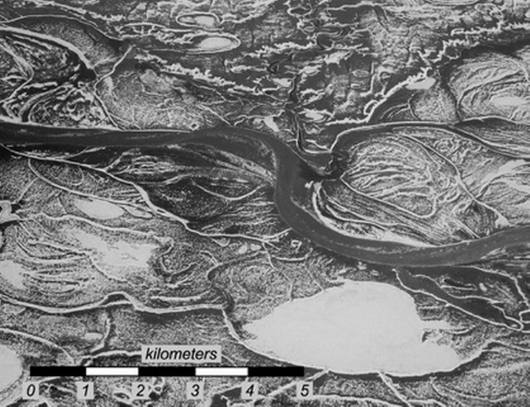
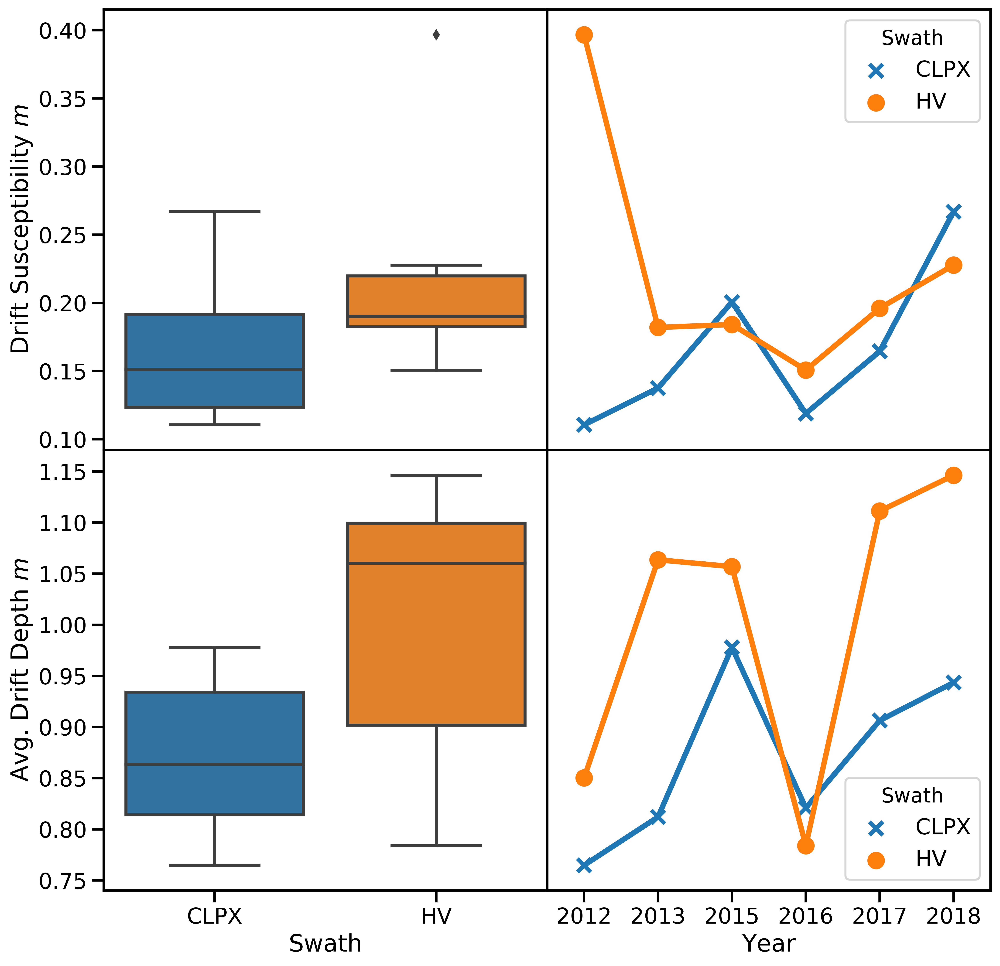
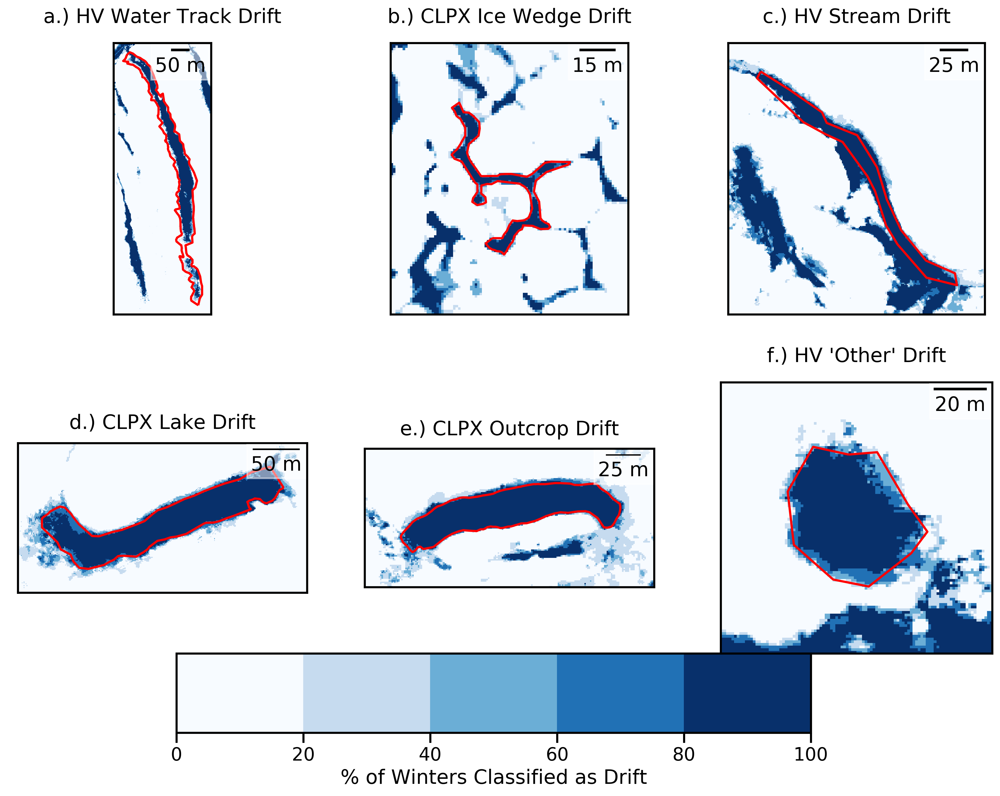
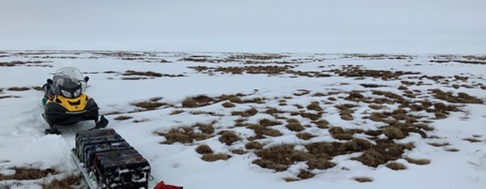
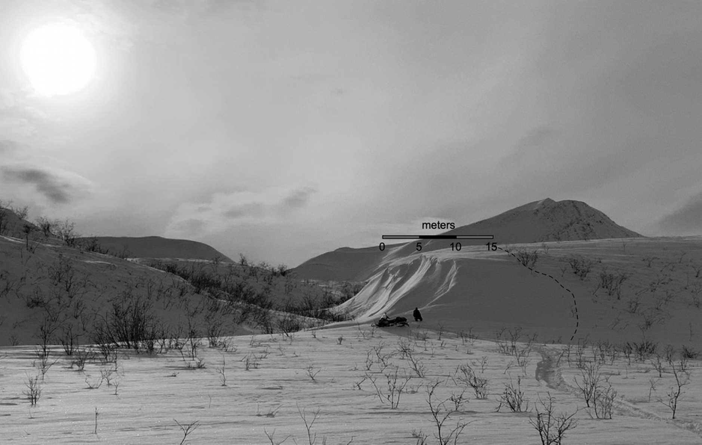
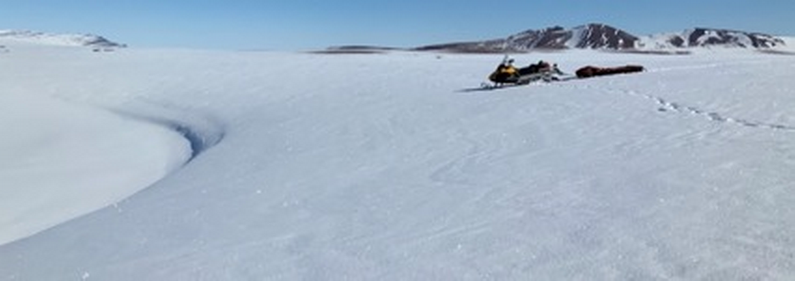
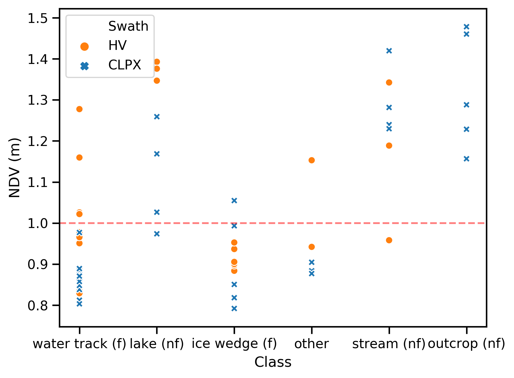
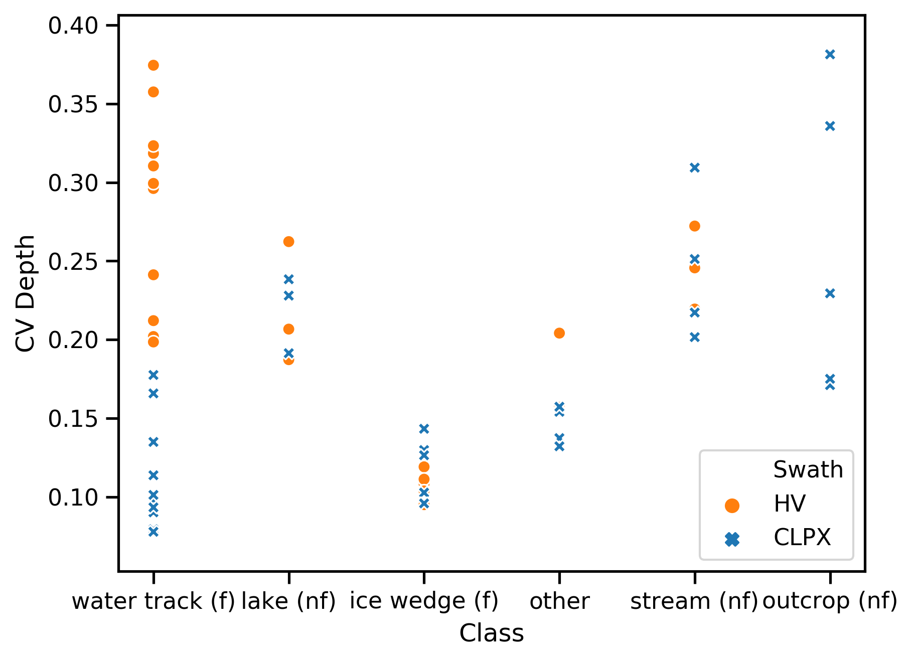

# Snowdrift Landscape Patterns: An Arctic Investigation

## Abstract

Between 2012 and 2018 we mapped the near-peak seasonal snow depths across two swaths totaling 126 km2 in Northern Alaska using aerial structure-from-motion photogrammetry and lidar surveys. These were validated by over a hundred thousand ground-based measurements. Using a quantitative method for identifying drift areas, we have produce a drift census that shows that on average 15% of the study area is covered by drifts each winter, with 40% of the snow-water-equivalent for the area contained in the drifts. Within the general census we identified six landscape-based classes of drifts, some of which fill each winter, others which do not, and identified distinct differences in drift type behavior largely explain by physiographic differences in the two swaths.  We tested year-to-year fidelity of drift patterns using four metrics from the field of image analysis, finding very high year-to-year similarities ranging from 77 to 83%, though there were significant differences between drift types. Our results are best explained by climatically convergent cumulative wind-blown snow fluxes interacting with drift traps that produce the same drifts despite considerable differences in winter weather. However, due to the existence of filling vs. non-filling drifts, and increasing rain-on-snow events in the Arctic, future snowdrift patterns in the Arctic may not mirror those of today.

## Introduction

Arctic snowdrifts are prominent landscape features that can extend for many kilometers and can be over 15 m deep. Over several decades of research (Benson, 1982; Benson and Sturm, 1993; Sturm and Wagner 2010; Sturm and Stuefer, 2013) it has been documented that these large drifts form reliably every winter, while summer imagery (Lauriol et al., 1986; Macander et al., 2015) shows that many of the drift persist through July before melting. Given their size, their recurrence, and the fact that the Arctic winter lasts 8-10 months of the year, we would suggest these drifts are essential components of the Arctic landscape, geomorphic features important in their own right.  Elsewhere, in the Rocky Mountains (Winstral et al., 2002; Hiemstra et al., 2006), in the Sierra Nevada (Kirchner et al., 2014), across the American and Canadian prairies (Pomeroy et al., 1993; Lapen and Martz, 1996), and in the high basins of the European Alps (Fohn and Meister, 1983; Schmidt 2009) and Spanish Pyrenees (Mases et al., 1998; Revuelto et al., 2014) similar large drifts form and are also long-lasting landscape features. We think these features deserve more scientific attention.

###### *Figure 1. Snow drifts on the North Slope of Alaska, May 25, 2019. The broad white areas are frozen lakes, largely snow-free. The sinuous white areas are ribbon drifts that formed in the lee of river cutbanks, lake edges, and bluffs. Here they range from several to more than 15 m deep, and from 0.5 to over 5 km in lineal extent.*

The impact of these large drifts, whether in the Arctic or elsewhere, extends well beyond the area covered by the drifts themselves. Conjugate scour zones form upwind and are the source of the additional snow for the drifts. These extensive scour zones, often several hundred meters wide and tens of kilometers long, serve important ecosystem functions for animals. For example they allow for easy travel and winter grazing for caribou (Pruitt, 1959). They also create trafficability problems for oil and gas exploration, which is performed in winter and requires sufficient snow to avoid damage to the underlying tundra (Felix and Raynolds, 1989; Sturm et al., 2019; Raynolds et al., 2020).

While it has been customary to treat snowdrifts and scour zones as areas of deeper (or shallower) than normal snow, known to produce more (or less) water for hydrologic run-off, little prior work on drifts as landscape features exists. Here we treat the drifts as quasi-permanent landscape structures, and consistent with that view, explore their geometry and distribution, just as one might for features such as cirques, tors, or nivation hollows. One rationale for taking this landscape perspective is that drifts are known to recur year after year in the same places and to take on similar forms each year, a phenomenon we call drift fidelity. We explore fidelity by comparing detailed multi-year snow depth maps from which we can derive show drift locations, sizes, and forms. The same maps allow us to produce a drift census (size, shape, type, setting), which documents that over 40% of the winter snow water equivalent (SWE) in our study area is stockpiled in drifts.  Since the study area is fairly typical of large areas of the Arctic, we can infer that drifts lock-up a sizeable fraction of the annual precipitation throughout much of the Arctic each year, re-affirming the importance of drifts in the regional hydrology.

Finally, we explore the sensitivity of the conjugate system of drifts and scour zones to a changing climate. While physically-linked by wind, this pattern segregates Arctic snow-water resources and related ecosystem services into zones that function in quite different ways. Snow run-off in scour zones, what little there is, occurs in spring when the ground is still frozen, limiting infiltration, while melt water from drifts is delayed until summer when the ground has thawed and infiltration can occur. In scour zones, high rates of sublimation (upwards of 40%) continue throughout the winter, but when blowing snow is stockpiled in a drift it is removed from the transport system and protected (Essery et al., 1999; see also Pomeroy et al., 1997; Liston and Sturm, 1998). This conservation function of snowdrifts has recently been observed in the Himalaya (Stigter et al., 2018), where a strong anti-correlation between the spatial distribution of sublimation intensity and the distribution of drifts was found. With such contrasting hydrological and ecological functioning, any change in the partitioning of the conjugate zones due to changes in wind and precipitation is likely to have large ramifications.

## Background

The connections between snow, wind transport, and topography, while well known, are still not fully understood, perhaps because the simplicity of the triadic relationship shown in Figure 2 masks surprising layers of complexity. For example, drift-available snow differs from the amount of snow actually present on the ground, which is simply the sum of winter precipitation (P) minus (or plus) transported snow (T), less sublimated snow (S). Available snow is controlled by vegetation (V), by wind shear stress, and by the spatial variability of snow adhesion. This latter property has proven difficult to measure or model because snow adhesion varies with grain characteristics and sintering, a temperature-dependent aging process that can be wildly heterogenous. It is not surprising, therefore, that prior studies have documented a 10X range in snow transport rates at any given wind speed (Sturm and Stuefer, 2013), a spread largely reflecting a wide range of surface snow conditions and therefore snow availability.

###### *Figure 2. The triadic relationship between snow availability, wind, and topography.*

The connection between wind transport and topography (gullies, river cutbanks, hillslopes, ridgelines, etc.) in principle is simpler: snow is deposited wherever the separation angle between wind streamlines and ground slope is sufficient to produce a local reduction in wind shear stress. But the finer details of this relationship are complicated by the turbulent nature of the wind when it blows over complex terrain. Eddies, rotors, and veering of the wind all take place. Local wind patterns are hard to measure, hard to visualize, and hard to model, yet they directly affect drift size and geometry. Additionally, as drifts grow and change through the winter, their form begins to affect the wind fields around them. One might say that the drifting snow never encounters the same landscape twice. Consistent with our landscape view of drifts, we might therefore invert the question of the linkage along this leg of the triad by asking: “What does the drift form and geometry tell us about the wind?”

Historically, the topography-drift connection has been studied using either a profile or a planimetric perspective. Engineers, faced with preventing railways and roads from being buried by drift (cf. Moore, 1922) sought optimal road cut profiles. Finney (1939), based on a combination of wind tunnel experiments and direct observations, concluded that for cuts steeper than 14° rotor eddies would form and deposit drifts that would clog the road. Rikhter (1954) and Kuz’min (1963) extended this work to more complex profiles, and the approach culminated when Tabler (1975) developed an empirical profile regression model based on up- and down-wind surface slopes. He introduced the term ‘equilibrium profile’ to describe the profile of a drift that cannot grow more because the topographic catchment has been filled, eradicating the separation angle necessary for deposition. Tabler’s equilibrium drifts are analogous to Cornish’s (1902) complete (vs. incomplete) drifts, and Sturm and Benson’s (1993) filling (vs. non-filling) drifts. Benson (1981), recognizing that prior to a drift being filled, it would capture all the blowing snow flux, began an annual series of surveys to monitor drift volume in NW Alaska that has been continued since then and is the longest drift size/profile record from the Arctic.

The planimetric (mapping) approach is newer and has been used to investigate the distribution of drifts at larger spatial scales. Kirnbaur (1991), Konig and Sturm (1998), Grayson et al., (2002), Winstral et al., (2002), and Parajka et al., (2012) all used aerial surveys to produce drift maps in plan view, seeking relationships between drifts and the underlying topography.  Klapa (1980), Lauriol et al. (1986), and Watson et al. (1994) used aerial photos to produce drift censuses, but lacking the ability to map drift depth, focused on changes in drift extent over time as climate indicators.  Drift fidelity, though not called by that name, has also been examined using planimetric mapping  in several studies (Luce and Tarboton 2004; Sturm and Wagner, 2010; Qualls and Arogundade, 2013).

Until now, uniting planimetric and profile approaches has been hampered by: (1) the lack of a quantitative definition of what constitutes a drift, (2) the lack of any way (other than laborious hand-probing) to obtain drift depth, and (3) the lack of automated algorithms to examine drift fidelity.  Here we propose a drift definition that we believe satisfies (1); airborne lidar and structure-from-motion (SfM) snow mapping techniques have solved issue (2), with such mapping now even possible using satellites (Shean et al., 2016), and  more robust computer methods for image comparison (see Chow and Paramesran, 2016) have largely solved issue (3).

## Field Areas

From 2012 through 2018 (except 2014) we used airborne SfM and lidar to map snow depth across two swaths (CLPX and HV) north of the Brooks Range in Alaska (Figure 3). Physiographically, these swaths span two types of terrain: (1) undulating, broad piedmont hills cut by abundant immature stream networks (i.e. water tracks), and (2) more rugged and rocky terrain with cliff bands (Table 1). Both swaths are tundra with shrub-tundra in riparian zones. The snow cover (excluding drifts) tends to be thin (< 0.6 m), comprised of six to ten layers, forms in September and lasts through May (see Benson and Sturm, 1993). Basal layers of depth hoar fill inter-tussock spaces and are typically capped by one or more wind slabs. Prevailing winter winds come from the south in the CLPX swath, and from the west in the HV swath. Drifts form in water tracks, along river and stream cutbanks, along the edges of inset lakes, and below outcrops of flat-lying or slightly dipping sedimentary rocks. Prior information on drifts in the area can be found in Evans et al., 1989; Sturm et al., 1995; Sturm et al., 2001; Walker et al., 2001; Liston and Sturm, 2002; Sturm and Stuefer, 2013).

###### *Figure 3: The study area in northern Alaska. The inset shows the location of the CLPX and HV swaths*

###### Table 1. CLPX and HV Physiography

|   | Slope: % of Area  |   |   |   |   | Mean Elevation    | Std. Dev. Elevation   | Total Area    |
|-------    |------------------ |---------  |---------  |---------  |------ |----------------   |---------------------  |------------   |
| Swath     | 0°-5°     | 5°- 10°   | 10°-15°   | 15°-30°   | >30°  |   |   |   |
| CLPX  | 70    | 23    | 4     | 2.7   | 0.3   | 862 m     | 53 m  | 97 km2    |
| HV    | 85    | 14    | 0.8   | 0.1   | 0.1   | 382 m     | 23 m  | 29 km2    |

## Snow Depth Mapping Methods
Snow depth mapping was done using airborne SfM photogrammetry (2015 though 2018) and lidar (2012 and 2013) and then adjusted to ground-based measurements (Figure 4). The area mapped each year was about 130 km2. To produce the maps, we: (1) conducted an airborne survey (snow-free) in June that was used to produce a snow-free digital elevation model (DEM) for each swath, (2) conducted multiple airborne surveys at near-peak snow cover each April that were used to create digital surface models (DSMs) of the snow cover, then (3) generated annual high resolution (1 m) snow depth maps by subtracting the snow-free DEM from the DSMs. Six such depth maps were produced for each swath between 2012 and 2018, comprising over 600 million individual geospatial snow depth records. The hardware, software, and processing steps used to go from the airborne survey data (photos or lidar returns) to snow depth maps is described in Johnson et al. (2013) and in Nolan et al. (2015).

###### *Figure 4: An example (from HV) of the snow mapping that forms the basis of this study. From left: a) the summer snow-free landscape, b) a topographic hillshade map, c) a snow depth map, and d-g) insets showing two (out of six) classes of drifts used in the drift census: (d and e): ice wedge drifts; (f and g): water track drifts.*

Acquiring the snow-free DEM required careful timing because tundra plants leaf out before all snowdrifts melt. We acquired an initial DEM using airborne lidar in 2012 and a second DEM using SfM in 2017. Both were acquired in early June, but in 2017 remnant snowdrifts covered some important parts of the field area. The 2017 DEM, however, was derived from a denser point cloud and therefore better quality where not obscured by snow. The two DEMs were ultimately fused together to leverage their respective strengths and make a single snow-free DEM.

The snow depth maps were field-validated and adjusted using 141,207 ground-based probe measurements collected concurrently with the airborne surveys. Differences between snow depth maps (raster data) and field probe measurements (vector data) arise from errors in converting point clouds to gridded surface models and from geolocation errors in both sets of data. The probe measurements, which use a WAAS-corrected GPS, have a positional uncertainty of ± 2.5 m and a quasi-random vertical depth uncertainty ranging from 0 to 0.05 m caused by a tendency to ‘over-probe’ down into the substrate below the snow (Sturm and Holmgren, 2018). The DEMs and DSMs have a position uncertainty estimated to be ± 0.30 m (Nolan et al., 2015), resulting in snow depth pixel locations accurate to about ±0.40 m. Without correcting either pixel or probe positions, we overlaid and differenced the two measurement sets for each swath and survey (Figure 5; see also Deems et al., 2013). Mean differences between probe and snow depth map values ranged from -0.06 to 0.40 m (Table 2). These offsets arise from the combination of positional and vertical errors, as well as noise in the GPS signals that accumulates over the course of the airborne surveys. As described by Nolan et al., (2015), we applied a global affine transformation to reduce the mean difference (probe minus snow depth map) value for each survey to zero. Once adjusted, the resulting snow depth maps are accurate to about ±0.10 m, which with respect to delineating drifts (which are 10X deeper) is insignificant. The resulting accuracy of the snow depth maps is comparable to that of other airborne snow depth mapping efforts (e.g. Deems et al., 2013; Buhler et al., 2015a; Nolan et al., 2015; Vander Jagt et al., 2015; De Michele at al., 2016; Buhler et al., 2016; Harder et al., 2016).

###### *Figure 5: The 2016 field validation campaign for the CLPX swath was typical. Over 11,000 ground measurements (black circles) were used to validate and adjust the final snow depth map (Table 2). Note the many drifts and conjugate scour zones in the eastern end of the swath.*

###### Table 2. Field Depths (Vector) Minus Snow Depth Maps (Raster) Prior to Correction, All Years.

## Results

### A General Snowdrift Census

To conduct a snowdrift census, we had to define a drift in a manner that could be automated and allowed for inter-annual variability. There is general agreement that a drift is an area where there has been an additional accumulation of snow deposited by the wind (T), but how much, and how can we be sure that the greater accumulation is actually a function of T rather than P? Researchers routinely recognize drifts in the field1, but that identification relies on layers of spatial and visual information including geometry (like recognizing a cornice lip), snow texture, and shadowing, all factors difficult to derive from remote sensing products in an automated fashion.

After a number of trials, we found that we could adequately define a drift in an area of interest (AOI) through the interaction of two functions: F1 - the percentage of the AOI covered by drifts (%DA), and F2 - the percentage of total snow volume in the AOI contained in the drifts (%DV). Using these functions, a depth threshold could be identified and all areas deeper than the threshold assumed to be drifts. To illustrate the procedure consider an AOI with normal snow depth distribution with a mean (μ) of 0.50 m and a standard deviation (σ) of 0.20 m (Figure 6).

###### *Figure 6: Setting the drift depth threshold using depth and volume cumulative distribution curves.*

When the drift threshold for this AOI is set at zero, 100% of the AOI is classified as drift, and all the snow volume is stockpiled in drifts as well, a nonsensical result. As the threshold increases in depth, both %DA and %DV decrease as expected, but at different rates, so the difference between the two functions increases.  For this synthetic example, that difference reaches a maximum at the mean depth (0.5 m) and then begins to fall. The rate at which the %DV-%DA difference changes (the derivative of the F2-F1 difference function) has two inflection points, the second at 0.70 m, and it is here we set the drift threshold (top, Figure 6). In this normally-distributed example, the threshold is exactly 1σ greater than the mean depth, though in real AOIs F1 and F2 are more complex and the threshold value is not simply 1σ above the AOI mean. It is encouraging to note, however, that prior to using this dual function approach, we actually used (μ+1σ) as our informal threshold-setting rubric. For real data, AOIs must be large enough to encompass the full range of measured snow depths, both drifts and scour, and the F1 and F2 functions have to be numerically differentiated.

We applied the drift definition to each of the 12 snow depth maps from the CLPX and HV swaths (Table 2), producing binary drift/no-drift maps for each swath and year. From these we were then able to derive census statistics  (Table 3). On average 14.5% of the area (both swaths) was covered by drifts, and these drift areas contained 30.1% of the snow by volume. Drift snow density in the study area exceeds 0.40 g/cm3 (Tabler, 1980; Sturm et al., 2001), while non-drift density varies between 0.25 to 0.35 g/cm3, so conservatively, we compute that more than 40% of the snow mass in the study area was contained in drifts.

We applied the drift definition to each of the 12 snow depth maps from the CLPX and HV swaths (Table 2), producing binary drift/no-drift maps for each swath and year. From these we were then able to derive census statistics  (Table 3). On average 14.5% of the area (both swaths) was covered by drifts, and these drift areas contained 30.1% of the snow by volume. Drift snow density in the study area exceeds 0.40 g/cm3 (Tabler, 1980; Sturm et al., 2001), while non-drift density varies between 0.25 to 0.35 g/cm3, so conservatively, we compute that more than 40% of the snow mass in the study area was contained in drifts.

###### Table 3. General Drift Census, CLPX and HV Swaths.

| Year   | Swath   |   Mean Depth (m) |   Depth Threshold (m) |   %DA |   %DV |   Total Drift Area (m2) |   Total Drift Volume (m3) |   Drift Susceptibility (m) |   Mean Drift Depth (m) |
|:-------|:--------|-----------------:|----------------------:|------:|------:|-----------------------------------:|-------------------------------------:|---------------------------:|-----------------------:|
| 2012   | CLPX    |             0.36 |                  0.58 | 14.47 | 30.49 |                           11159142 |                              8534785 |                       0.11 |                   0.76 |
| 2012   | HV      |             0.56 |                  0.73 | 15.81 | 28.72 |                           16339939 |                             13892606 |                       0.4  |                   0.85 |
| 2013   | CLPX    |             0.53 |                  0.68 | 16.94 | 26.17 |                           13343689 |                             10835767 |                       0.14 |                   0.81 |
| 2013   | HV      |             0.61 |                  0.79 | 17.12 | 29.9  |                            3539923 |                              3765028 |                       0.18 |                   1.06 |
| 2015   | CLPX    |             0.55 |                  0.77 | 20.52 | 36.67 |                           19582357 |                             19149292 |                       0.2  |                   0.98 |
| 2015   | HV      |             0.71 |                  0.85 | 17.43 | 26.01 |                            4972993 |                              5256015 |                       0.18 |                   1.06 |
| 2016   | CLPX    |             0.46 |                  0.65 | 14.49 | 25.65 |                           13509082 |                             11089609 |                       0.12 |                   0.82 |
| 2016   | HV      |             0.52 |                  0.63 | 19.23 | 28.73 |                            5051349 |                              3960200 |                       0.15 |                   0.78 |
| 2017   | CLPX    |             0.5  |                  0.7  | 18.15 | 32.91 |                           17116729 |                             15513594 |                       0.16 |                   0.91 |
| 2017   | HV      |             0.63 |                  0.82 | 17.65 | 30.91 |                            4913711 |                              5460065 |                       0.2  |                   1.11 |
| 2018   | CLPX    |             0.58 |                  0.81 | 21.24 | 38.44 |                           31080363 |                             29326779 |                       0.27 |                   0.94 |
| 2018   | HV      |             0.65 |                  0.84 | 19.87 | 35.13 |                            5554577 |                              6367217 |                       0.23 |                   1.15 |
| AVE.   |      |             0.56 |                  0.74 | 17.74 | 30.81 |                           12180321 |                             11095913 |                       0.19 |                   0.94 |

*Note: The CLPX swath (~96 km2) was about 3.3X larger than the HV swath (~29 km2) (Table 1) and this sample size difference is reflected in the area and volume values, but not the %DA and %DV values. Total mapped area varied slightly from one year to the next due to flight line variations.*

One of the key metrics produced in the census was drift susceptibility, shown graphically in Figure 7 (top). This metric, computed by dividing total drift volume (m3) by the total mapped swath area (m2), can be thought of as the additional depth of snow (m) that would be present over the entire swath if all drift snow was mined out and redistributed evenly. The susceptibility values ranged from 0.11 to 0.27 m, with the HV and CLPX swaths having similar values and tracking each other from year to year reasonably well. These depth values seem small, but when compared to the mean snow depth for each swath and survey date (drift plus non-drift areas: Table 3), the metric indicates that the presence of drifts in tundra landscapes like the study area effectively reduces the overall non-drift snow depth by a substantial amount. For the cases captured in our measurements, that reduction is between 26 and 70%. This is a significant reduction in a region where the general winter snow cover is thin, and suggests to us that drifts, in addition to having a direct impact where the drifts lie, have an extended impact in the conjugate scour zones, they also have a more subtle but widespread impact on the regional snow depth.

While drift susceptibility, threshold depth, and areal coverage (%DA) tracked well between the two swaths, mean drift depth and volume (Fig. 7 bottom) did not, suggesting some dynamic difference in snow transport and/or trapping processes between the two swaths. We can assume that transport (T) processes were probably reasonably similar, given that the swaths are geographically close together and get about the same amount of wind and precipitation, so the likely source of the difference lies in how the snow was trapped. The physiography of the two swaths is quite different (Table 1), with considerably more steep ground and sharper topographic breaks in the CLPX swath. As we will show in the next section, those topographic differences manifest as different types of drifts. Specifically, the CLPX swath has more cutbank and lake bluff traps (producing more drifts like those shown in Figure 1), while the HV swath has far more (and more incised) water tracks and ice wedge polygon terrain. These latter traps fill far more readily than the former traps, which are much larger and have a much greater capacity to stockpile snow, rarely filling during a winter, resulting in less variation in depth and volume from one year to the next.

###### *Figure 7 (top): Drift susceptibility for the CLPX and HV swaths track each other, but note that the range of drift susceptibility was nearly twice as large for CLPX as for HV. Figure 7 (bottom): drift depth (computed by dividing the drift volume by the drift area) does not track between HV and CLPX swaths, and again CLPX shows greater variability.*

### A Snowdrift Type Census

To explore more fully the difference in the nature of the drift traps in the two swaths, we introduced into our drift definition two additional concepts: connectivity and fidelity. For each one meter square pixel on our drift/no-drift maps, we determined the number of winters when that pixel was classified as a drift (e.g., in 5 of the 6 winters). We color-coded each pixel to represent this value, a procedure that then allowed us to collapse all six years of results to a single pixel fidelity map. We then searched the fidelity map for areas where there were contiguous and distinctive blocks of high fidelity (>80% of time) pixels. These areas we assumed to be drift structures showing strong year-to-year fidelity. We manually outlined these areas on a computer to serve as the  basis for a second classification and census, this time by drift type.  We ended with a sample of 59 outlined drifts.  These we matched to the “green” landscape features underlying the drifts.1 When the entire process was completed, we found we had six recognizable drift types with clear associations to the underlying snow-free landforms. The types (Fig. 8) that emerged are: 
    1. water track drifts   (n=22) 
    2. stream fill drifts   (n=7) 
    3. ice wedge drifts     (n=12) 
    4. outcrop drifts       (n=5) 
    5. lake drifts, and     (n=7) 
    6. other.               (n=6)  
Two of the “green” landforms are unique to high latitudes: water tracks and ice wedge polygons.

###### *Figure 8: Six snowdrift classes.* 

Water tracks (Figs. 8a and 9: see also McNamara et al., 1998; Trochim et al., 2016; Paquette et al., 2017) are lightly incised hillslope drainage pathways that show little branching and are controlled by permafrost. Being of limited depth, the tracks typically fill in winter, taking on an equilibrium drift profile (Tabler, 1975). However, it is common for water tracks to come in groups of near-parallel down-slope networks, and when these are oriented across the wind, upwind tracks can rob downwind tracks of wind-blown snow, leaving the downwind tracks unfilled. While it remains speculative, the quasi-regular spacing of hillslope water tracks, which is quite common in the HV swath (Fig. 9:  see also König and Sturm, 1998), could be related to winter drifting and filling vs. non-filling drifts. The connection between winter and summer processes would be that drift-augmented snowmelt run-off within a water track would flush the track each spring, accelerating its incision through both thermal and physical erosion, while the scouring of snow from the interfluves between tracks would ensure little erosion in those locations. Downwind, where the drifts would no longer be filled, the erosion would decrease.

###### *Figure 9: Regularly spaced water tracks in the HV swath. The upper panorama shows 9 nearly parallel tracks with the dark areas between the tracks being thin snow areas that have been cratered by foraging caribou. The depth cross-section (blue) indicates the tracks in this survey  held about 1.2 m of drift snow, while ground observations suggested that most of the tracks had achieved equilibrium profiles. The transport wind was from the west (right side of image). Because the tracks favor the growth of willow and birch shrubs, they appear darker than the surrounding tundra in summer (bottom panel).*

Ice wedge drifts (Figs. 8b and 10) form in the network of troughs surrounding high-centered polygons (Black, 1952; Jorgenson and Osterkamp, 2005; Gamon et al., 2012). These troughs (which can be up to 1.5 m deep) develop because the ice wedge areas thaw more rapidly than the permafrost in polygon centers. Because polygon fields consist of repeated patterns of high and low ground, ice wedge drifts (Fig. 10) also occur on repeating spatial scales, with distances between drifts ranging from 3 to 20 meters. Where there is sufficiently strong winds and deep enough troughs, the polygon centers can sometimes become scoured free of all snow, yet immediately adjacent to this bare ground are drifts as much as 1.5 m deep. In our study area polygonal ground is not the dominant land form, though it is present, but to the north on the Arctic coastal plain, vast areas are covered by polygon fields, making this type of Arctic snow drift widespread. Like water track drifts, ice wedge drifts general tend to fill to equilibrium.

###### *Figure 10: Ice wedge drifts on the Arctic coastal plain near the study area. Here the drifts in the troughs between partially bare polygon centers were over 1.5 m deep.*

Cutbanks along streams and rivers trap large snowdrifts that are sometimes referred to as  ribbon drifts due to their long extent and sinuous outline (Figures 1, 8c, and 11). The drainage features that produce these drifts are larger, more incised, and most importantly, have sharper breaks in slope along channel edges than do water tracks. One oddity of the geography and climatology of northern Alaska is that many of the stream and river drainages trend south to north, while the winter winds are often either from the east or west, creating an ideal scenario for producing this type of drift. Because these traps are both deep and wide, they generally do not fill during the winter, which was what motivated Benson (1983) to use this type of drift to measure winter wind-blown flux rates. In fact, depending on size and the total winter wind-blown flux, stream drifts can switch from non-filling to filling depending on the winter. In our experience, it is stream width (not depth) that determines whether this transition is likely to occur.  When the drift forming on the windward cutbank manages to coalesce with the smaller drift that forms on the opposite cutbank facing into the wind (a leading edge drift according to Kuz’min, 1963), then an equilibrium profile is soon achieved (see Benson and Sturm, 1992; Figure 2) and the drift ceases to grow further.

###### *Figure 11: A stream drift (also ribbon drift) in the Brooks Range. The wind was from the right (west) and has been moving snow into this side valley for over 6 months, but it has not yet, and is unlikely to ever, fill the drift trap.*

Lake snowdrifts (Figures 1, 8d, and 12) tend to be crescentic. Many of the lakes in northern Alaska are incised into the landscape and have a quasi-circular shape. Given such a shape, they (in principle) could trap wind-blown snow from any direction and so produce a ‘flux rose’ in the form of lake drifts. More often, though, the prevailing winds come from one direction and these produce a crescentic drift on the windward side of the lake while on the opposite side there is a scour zone (Sturm and Liston, 2003; Rees et al., 2013). Filled lake drifts create a smooth ‘apron’ with a near-constant slope down to the lake ice surface, while non-filling lake drifts have cornice edges and a sheer drop to the ice below (Fig. 12).

###### *Figure 12: A crescentic lake drift in the CLPX swath. The snowmobile is at the edge of the underlying ground topography, with the drift forming out from there onto the snow-covered ice surface. This drift was 5 m deep just in front of the snowmobile.*

Outcrop snowdrifts (Figure 8e) occurred only in the CLPX swath in our study. In that swath tilted or flat-lying rock ledges were exposed in several areas. This produced two kinds of drifts based on the orientation of the outcrop and the transport winds: leading edge drifts that formed against the base of windward-facing cliffs, and drifts similar to stream drifts that formed downwind of steep leeward faces.

The final type,  “other” (Figure 8f),  were those drifts in our sample set that had no obvious association with the underlying topography. These were most often found on hillslopes of mild grades (slopes of a few degrees) and formed irregularly-shaped patches, suggesting that perhaps some subtle upwind topographic feature had created enough flow separation to trigger snow deposition, but not produce a recognizable topographic structure.

The drift type census appears in Table 4. Broadly, the six classes can be divided into filling (f) and non-filling (nf) types. Not surprisingly, non-filling drifts are deeper than filling drifts, and as consequence, have higher NDV values (NDV= area-normalized drift volumes, computed for each drift by dividing the drift volume by its area, producing essentially a drift depth).  The NDV metric for a particular drift on a particular date, in a sense, is a measure of how close to being filled that drift is with respect to what would be normal for that type of drift. For example, a lake drift with an NDV value equal 1 would be under-performing (not filled yet), while a water track drift with the same NDV would be unusually deep and probably near or at its equilibrium profile. Theoretically,  the maximum NDV (NDVmax) is reached when a drift becomes filled (reaches its equilibrium profile). If we knew this value for a given drift, and its current NDV value, we would then know how far from being full the drift was at the time it was measured. While NDVmax undoubtedly varies slightly for each drift, the results in Table 4 and Figure 13 suggest strongly that each drift type has a distinctive NDVmax , potentially a useful finding.  

###### Table 4: Mean Drift Type Statistics by Swath: *f* Indicates Filling; *nf* Indicates Non-filling

| Swath   | Class           | Drift Area (m2)   | Mean Drift Depth (m)   | Drift Volume (m3)   | Std. Depth (m)   | CV Depth   | NDV (m)   |
|:--------|:----------------|:-----------------------------|:-----------------------|:-------------------------------|:-----------------|:-----------|:----------|
| CLPX    | ice wedge (f)   | 369                          | 0.89                   | 350                            | 0.11             | 0.12       | 0.9       |
| HV      | ice wedge (f)   | 850                          | 0.91                   | 775                            | 0.1              | 0.11       | 0.91      |
| CLPX    | lake (nf)       | 23832                        | 1.11                   | 26790                          | 0.25             | 0.22       | 1.11      |
| HV      | lake (nf)       | 71678                        | 1.37                   | 98619                          | 0.3              | 0.22       | 1.37      |
| CLPX    | other           | 212890                       | 0.89                   | 187530                         | 0.13             | 0.15       | 0.89      |
| HV      | other           | 12722                        | 1.05                   | 12185                          | 0.19             | 0.18       | 1.05      |
| CLPX    | outcrop (nf)    | 5431                         | 1.32                   | 7522                           | 0.35             | 0.26       | 1.32      |
| HV      | outcrop (nf)    | N/A                          | N/A                    | N/A                            | N/A              | N/A        | N/A       |
| CLPX    | stream (nf)     | 20247                        | 1.29                   | 25466                          | 0.31             | 0.24       | 1.29      |
| HV      | stream (nf)     | 2182                         | 1.16                   | 2563                           | 0.29             | 0.25       | 1.16      |
| CLPX    | water track (f) | 2287                         | 0.87                   | 2056                           | 0.1              | 0.11       | 0.86      |
| HV      | water track (f) | 20967                        | 0.99                   | 21583                          | 0.28             | 0.28       | 0.99      |

###### *Figure 13: NDV values (snowdrift volume-to-area ratios) for six classes of drifts. The red dashed line roughly separates filling from non-filling drifts*

The other diagnostic metric related to drift type is the coefficient of variance (CV) of drift depth (Table 4 and Fig. 14). This metric captures some of the differences in filling and non-filling drift behavior.  For example, ice wedge drift CV values are low and similar for both swaths, suggesting that across the study area the geometry of the ice wedge polygons is constant, with the ice wedge troughs generally not so deep that they cannot be filled with snow each winter. This similarity makes sense: trough depth is controlled by subsurface thawing, a regional effect of summer temperature. Our field experience is that the ice wedge troughs are usually filled with snow by January, and that the fill depth changes little from one winter to the next.  In contrast, the CV values for stream, lake, and outcrop drifts are more than twice that of ice wedge troughs.  These types of drifts are unlikely to fill during the winter, hence the drift depth tends to vary depending on winter conditions. More puzzling, the CV values for water track drifts differed markedly between the two swaths, with the HV water track drifts showing nearly 3X the variation of CLPX swath. This difference suggests that the HV water tracks are in some ways different than the CLPX water tracks, and perhaps do not fill as often.  Perhaps the HV water tracks are deeper, or as suggested in Figure 9, perhaps not all of the fill due to upwind stockpiling of snow.

###### *Figure 14: CV values by drift class.*

In Figure 15 we have tried to summarize one of the key differences in drift types by regressing drift volume against drift area using data from all 59 drift samples. The slopes of the lines  (i.e., NDV) range from 0.86 (ice wedge drifts) to 1.56 (outcrop drifts), with a value of around 1.1 appearing to be the transition value between f and nf drifts. Landscapes with drift traps that have low slopes on this plot will in most winters trap the same amount of snow, while landscapes with high slopes will have excess trapping capacity and will respond to changes in the total winter wind-blown flux through changes in the volume (and depth) of the drifts. The figure suggests why in the general census (Table 3) the CLPX drifts exhibited greater variability in both depth and volume (Fig. 7 bottom) than the HV drifts: the CLPX swath contains more high slope drift traps, hence represents a more dynamic environment for drift formation. 

