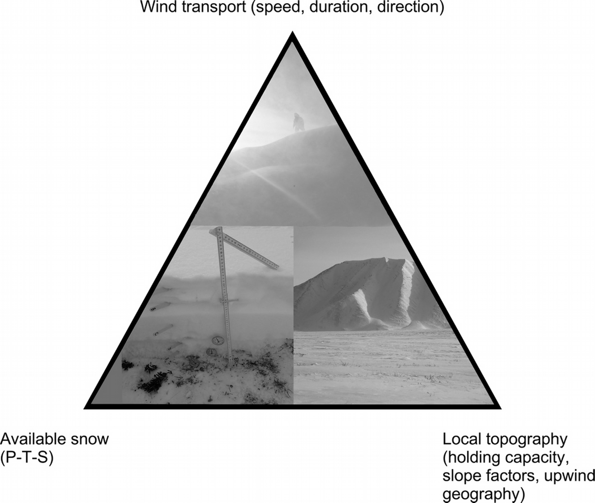
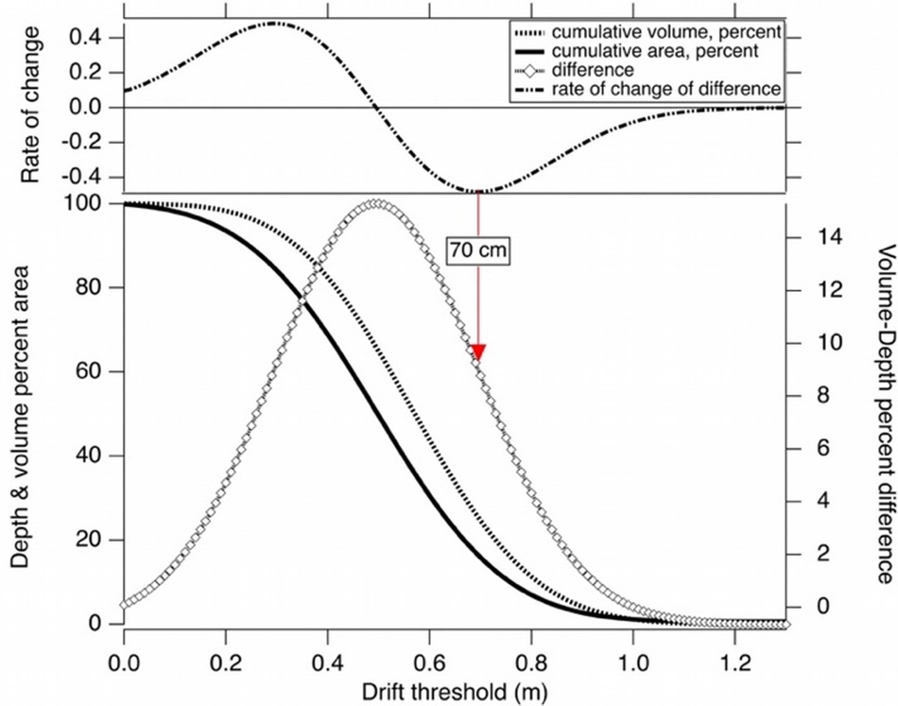
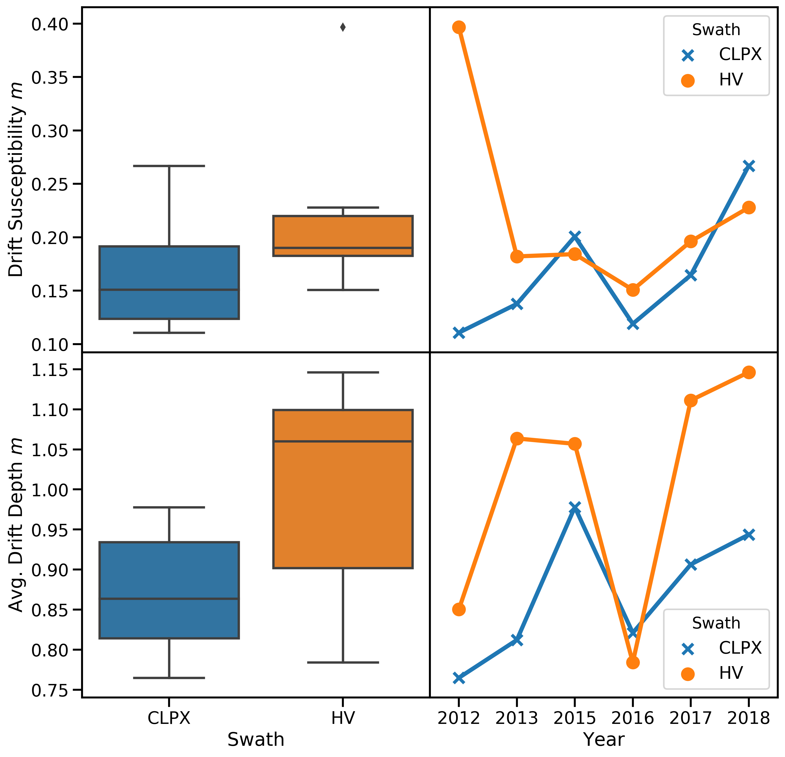
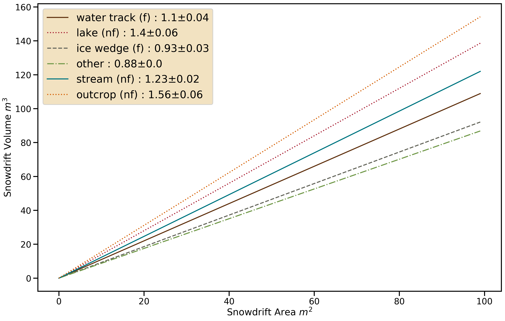
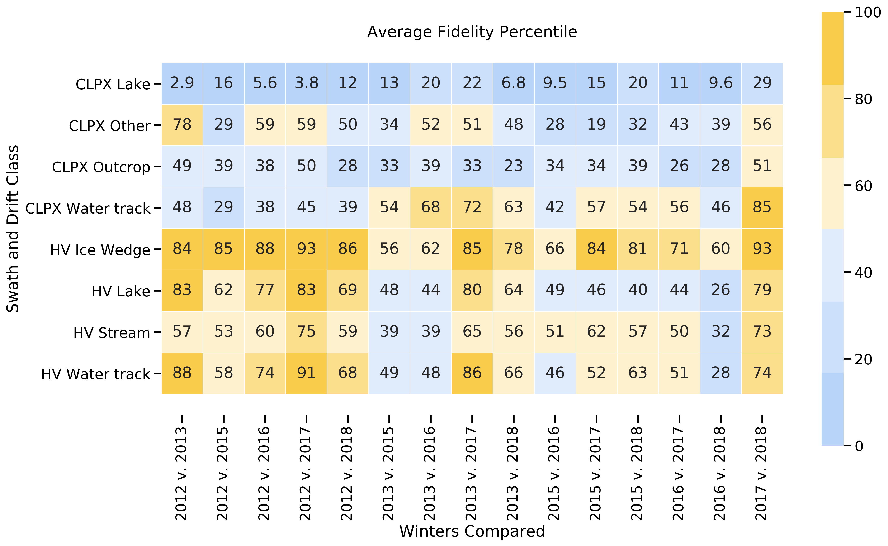

# Snowdrift Landscape Patterns: An Arctic Investigation

## Abstract

Between 2012 and 2018 we mapped near-peak seasonal snow depths across two swaths covering 126 km2 in Northern Alaska using aerial structure-from-motion photogrammetry and lidar surveys. The surveys were validated by over a hundred thousand ground-based depth measurements. Using a quantitative method for identifying drift areas, we conducted a snowdrift census that showed on average 18% of the study area covered by snowdrifts each winter, with 40% of the snow-water-equivalent contained in the drifts. Within the general census we identified six types of drifts, some of which fill each winter, others which do not. The seasonal drift evolution was distinctly different in the two swaths, a result largely explained by physiographic differences between swaths. Using four metrics from the field of image quality analysis, we tested the year-to-year fidelity of these drift patterns, finding overall high year-to-year similarity (>70%), but with higher similarity values for filling drifts, and higher similarity in one swath vs. the other, again a function of the physiography. These high drift fidelity values are best explained by climatically convergent cumulative wind-blown snow fluxes interacting with drift traps to produce the same drifts year after year despite considerable differences in winter weather. However, due to the existence of filling vs. non-filling drifts, and a predicted increasing frequency of rain-on-snow events in the Arctic, future snowdrift patterns and drift evolution in the Arctic are likely to diverge from those of today.

## Introduction

Arctic snowdrifts are prominent landscape features that can extend for many kilometers and can be over 15 m deep. Over several decades of research (Benson, 1981; Benson and Sturm, 1993; Sturm and Wagner 2010; Sturm and Stuefer, 2013) it has been documented that these large drifts form reliably every winter, while summer imagery (Lauriol et al., 1986; Macander et al., 2015) shows that the drifts often persist into July before melting. Given their size, their recurrence, and the fact that the Arctic winter lasts 8-10 months of the year, drifts are an essential component of the Arctic landscape, geomorphic features important in their own right. A similar view can be taken for the Rocky Mountains (Winstral et al., 2002; Hiemstra et al., 2006), the Sierra Nevada (Kirchner et al., 2014), the American and Canadian prairies (Pomeroy et al., 1993; Lapen and Martz, 1996), and the high basins of the European Alps (Fohn and Meister, 1983; Schmidt 2009) and Pyrenees (Mases et al., 1998; Font et al., 2001; Revuelto et al., 2014), where similarly large drifts form each winter and are long-lasting landscape features.

The impact of these large drifts, whether in the Arctic or elsewhere, extends well beyond the area covered by the drifts themselves. Conjugate scour zones usually form upwind of the drifts and are the source of much of the additional snow. These scour zones, which can be several hundred meters wide and tens of kilometers long, like drifts, have important surface energy balance and ecosystem functions. For example they allow for easy travel and winter grazing for caribou (Pruitt, 1959). They also create trafficability problems for oil and gas exploration, which is performed in winter and requires sufficient snow cover to avoid damage to the underlying tundra (Felix and Raynolds, 1989; Sturm et al., 2019; Raynolds et al., 2020).

While it has been customary to account for drifts in run-off models as areas of deeper than normal snow, little prior work exists on drifts as landscape features. Here we treat the drifts as quasi-permanent structures, and consistent with that view, explore their geometry and distribution, just as one might for features such as cirques, tors, or nivation hollows. One rationale for taking this landscape perspective is that drifts recur year after year in the same places and take on similar forms, a phenomenon we call drift fidelity. We explore fidelity and other drift characteristics using detailed multi-year snow depth maps from which we have been able to derive snowdrift location, form, and size, data that form the basis of a drift census that documents that over 40% of the winter snow water equivalent (SWE) in the study area is stockpiled in drifts.  Since the study area is typical of large areas of the Arctic, we therefore can infer that drifts lock-up a sizeable fraction of the annual precipitation throughout the region, re-affirming the importance of drifts in the regional hydrology and providing a compelling reason to understand to understand these features better.

We end the paper with a discussion of what might happen to Arctic drifts in a rapidly changing climate. While physically-linked by wind, the drift-scour pattern that is so common in the region sharply segregates Arctic snow-water resources and related ecosystem services into zones that function in quite different ways. Snow run-off from scour zones, what little there is, occurs in spring when the ground is still frozen, limiting infiltration, while melt water from drifts is delayed until summer when the ground has thawed and infiltration can occur. In scour zones, high rates of sublimation (upwards of 40%) continue throughout the winter, but when blowing snow is stockpiled in a drift it is removed from the transport system and protected (Essery et al., 1999; see also Pomeroy et al., 1997; Liston and Sturm, 1998). This snowdrift conservation function has recently been observed in the Himalaya (Stigter et al., 2018), where a strong anti-correlation between the spatial distribution of sublimation intensity and the distribution of drifts was found. With such contrasting hydrological and ecological functioning, any change in the partitioning of the conjugate zones due to changes in wind, precipitation, and driftability, is likely to have large ramifications.

###### *Figure 1. A triadic relationship between snow availability, wind transport, and topography governs snow drift formations on the North Slope of Alaska.*

## Background

The connections between snow, wind transport, and topography, while well known, are still not fully understood, perhaps because the simplicity of the triadic relationship shown in Figure 1 masks surprising layers of complexity. For example, drift-available snow differs from the amount of snow actually present on the ground, which is simply the sum of winter precipitation (P) minus (or plus) transported snow (T), less sublimated snow (S). Available snow is controlled by vegetation (V), by wind shear stress, and by the spatial variability of snow cohesion. This latter property has proven difficult to measure or model because snow cohesion varies with grain characteristics and sintering, a temperature-dependent aging process that can be wildly heterogenous. It is not surprising, therefore, that prior studies have documented a 10X range in snow transport rates at any given wind speed (Sturm and Stuefer, 2013), a spread largely reflecting a wide range of surface snow conditions and therefore snow availability.

The connection between wind transport and topography (gullies, river cutbanks, hillslopes, ridgelines, etc.) in principle is simpler: snow is deposited wherever the separation angle between wind streamlines and ground slope is sufficient to produce a local reduction in wind shear stress. But the finer details of this relationship are complicated by the turbulent nature of the wind when it blows over complex terrain. Eddies, rotors, and veering of the wind are hard to measure, hard to visualize, and hard to model, yet they directly affect drift size and geometry. Additionally, as drifts grow and change through the winter, their form begins to affect the wind fields around them. One might say that drifting snow never encounters the same landscape twice.

Historically, the topography-drift connection has been studied using either a profile or a planimetric perspective. Engineers, faced with preventing railways and roads from being buried by drifts (cf. Moore, 1922), sought optimal road cut profiles. Finney (1939), based on a combination of wind tunnel experiments and direct observations, concluded that for cuts steeper than 14° rotor eddies would form and deposit drifts that would clog the road. Rikhter (1954) and Kuz’min (1963) extended this work to more complex profiles, and the approach culminated with Tabler's (1975) empirical profile regression model based on up- and down-wind surface slopes. He introduced the term ‘equilibrium profile’ to describe the profile of a drift that cannot grow more because the topographic catchment has been filled, eradicating the separation angle. Tabler’s equilibrium drifts are analogous to Cornish’s (1902) complete (vs. incomplete) drifts, and Benson and Sturm’s (1993) filling and non-filling drifts. Benson (1981), recognizing that prior to a drift being filled, it would capture all blowing snow flux, began an annual series of surveys to monitor drift volume in NW Alaska that has been continued sporadically since then and is the longest drift size/profile record from the Arctic.

The planimetric (mapping) approach is newer and has been used to investigate the distribution of drifts at larger spatial scales. Kirnbaur (1991), Konig and Sturm (1998), Grayson et al., (2002), Winstral et al., (2002), and Parajka et al., (2012) all used aerial surveys to produce planimetric drift maps, seeking relationships between drifts and the underlying topography.  Klapa (1980), Lauriol et al. (1986), and Watson et al. (1994) used aerial photos to produce drift censuses, but lacking the ability to map drift depth, focused on changes in drift extent over time as climate indicators.  Drift fidelity, though not called by that name, was also examined using planimetric mapping  in several studies (Luce and Tarboton 2004; Sturm and Wagner, 2010; Qualls and Arogundade, 2013).

To date, uniting planimetric and profile approaches has been hampered by: (1) the lack of a quantitative definition of what constitutes a drift, (2) the lack of any way (other than laborious hand-probing) to obtain drift depth, and (3) the lack of automated algorithms to examine drift fidelity.  Here we propose a drift definition procedure that we believe satisfies (1); airborne lidar and structure-from-motion (SfM) snow mapping techniques have mostly solved (2), with drift mapping now even possible using satellites (Marti et al., 2016; Shean et al., 2016). More robust computer methods for image comparison (see Chow and Paramesran, 2016) have greatly improved our ability to address issue (3).

## Field Areas

From 2012 through 2018 (except 2014) we used airborne SfM and lidar to map snow depth across two swaths (CLPX and HV) north of the Brooks Range in Alaska (Figure 3). Physiographically, these swaths span two types of terrain: (1) undulating, broad piedmont hills cut by abundant immature stream networks (i.e. water tracks), and (2) more rugged and rocky terrain with cliff bands (Table 1). Both swaths are tundra with shrub-tundra in riparian zones. The snow cover (excluding drifts) tends to be thin (< 0.6 m), comprised of six to ten layers, forms in September and lasts through May (see Benson and Sturm, 1993). Basal layers of depth hoar fill inter-tussock spaces and are typically capped by one or more wind slabs. Prevailing winter winds come from the south in the CLPX swath, and from the west in the HV swath. Drifts form in water tracks, along river and stream cutbanks, along the edges of inset lakes, and below outcrops of flat-lying or slightly dipping sedimentary rocks. Prior information on drifts in the area can be found in Evans et al., 1989; Sturm et al., 1995; Sturm et al., 2001; Walker et al., 2001; Liston and Sturm, 2002; Sturm and Stuefer, 2013.

###### *Figure 3: The study area in northern Alaska. The inset shows the location of the CLPX and HV swaths.*

###### Table 1. CLPX and HV Swath Physiography

|   | Slope: % of Area  |   |   |   |   | Mean Elevation    | Std. Dev. Elevation   | Total Area    |
|-------    |------------------ |---------  |---------  |---------  |------ |----------------   |---------------------  |------------   |
| Swath     | 0°-5°     | 5°- 10°   | 10°-15°   | 15°-30°   | >30°  |   |   |   |
| CLPX  | 70    | 23    | 4     | 2.7   | 0.3   | 862 m     | 53 m  | 97 km2    |
| HV    | 85    | 14    | 0.8   | 0.1   | 0.1   | 382 m     | 23 m  | 29 km2    |

## Snow Depth Mapping Methods
Snow depth mapping was done using airborne SfM photogrammetry (2015 though 2018) and lidar (2012 and 2013) and then adjusted to ground-based measurements (Figure 4). The area mapped each year was about 130 km2. To produce the maps, we: (1) conducted an airborne survey (snow-free) in June that was used to produce a snow-free digital elevation model (DEM) for each swath, (2) conducted multiple airborne surveys at near-peak snow cover each April that were used to create digital surface models (DSMs) of the snow cover, then (3) generated annual high resolution (1 m) snow depth maps by subtracting the snow-free DEM from the DSMs. Six such depth maps were produced for each swath between 2012 and 2018, comprising over 600 million individual geospatial snow depth records. The hardware, software, and processing steps used to go from the airborne survey data (photos or lidar returns) to snow depth maps is described in Johnson et al. (2013) and in Nolan et al. (2015).

###### *Figure 4: An example from the HV swath of the snow depth mapping that forms the basis of this study. From left: a) the snow depth across the entire HV swath, b) a topographic hillshade map revealing ice wedge polygons, c) a hillshade map for a set of water tracks, d-e) insets for same areas as b and c showing two (out of six) classes of drifts used in the drift census: ice wedge and water track, and f) ice wedge drifts.*

Acquiring the snow-free DEM required careful timing because tundra plants leaf out before all snowdrifts melt. We acquired an initial DEM using airborne lidar in 2012 and a second DEM using SfM in 2017. Both were acquired in early June, but in 2017 remnant snowdrifts covered some important parts of the field area. The 2017 DEM, however, was derived from a denser point cloud and therefore better quality where not obscured by snow. The two DEMs were ultimately fused together to leverage their respective strengths and make a single snow-free DEM.

The snow depth maps were field-validated and adjusted using 141,207 ground-based probe measurements collected concurrently with the airborne surveys. Differences between snow depth maps (raster data) and field probe measurements (vector data) arise from errors in converting point clouds to gridded surface models and from geolocation errors in both sets of data. The probe measurements, which use a WAAS-corrected GPS, have a positional uncertainty of ± 2.5 m and a quasi-random vertical depth uncertainty ranging from 0 to 0.05 m caused by a tendency to ‘over-probe’ down into the substrate below the snow (Sturm and Holmgren, 2018). The DEMs and DSMs have a position uncertainty estimated to be ± 0.30 m (Nolan et al., 2015), resulting in snow depth pixel locations accurate to about ±0.40 m. Without correcting either pixel or probe positions, we overlaid and differenced the two measurement sets for each swath and survey (Figure 5; see also Deems et al., 2013). Mean differences between probe and snow depth map values ranged from -0.06 to 0.40 m (Table 2). These offsets arise from the combination of positional and vertical errors, as well as noise in the GPS signals that accumulates over the course of the airborne surveys. As described by Nolan et al., (2015), we applied a global affine transformation to reduce the mean difference (probe minus snow depth map) value for each survey to zero. Once adjusted, the resulting snow depth maps are accurate to about ±0.10 m, which with respect to delineating drifts (which are 10X deeper) is insignificant. The resulting accuracy of the snow depth maps is comparable to that of other airborne snow depth mapping efforts (e.g. Deems et al., 2013; Buhler et al., 2015a; Nolan et al., 2015; Vander Jagt et al., 2015; De Michele at al., 2016; Buhler et al., 2016; Harder et al., 2016).

###### *Figure 5: The 2016 field validation campaign for the CLPX swath was typical. Over 11,000 ground measurements (black circles) were used to validate and adjust the final snow depth map (Table 2). Note the many drifts and conjugate scour zones in the eastern end of the swath. Depths cannot be derived for water bodies (lakes), which show up as bright red (zero snow).*

###### Table 2. Field Depths Minus Snow Depth Raster Values Prior to Correction, All Years.

| Year   | Swath   | Count   | Mean (m)   | Std. (m)   |
|:-------|:--------|:--------|:-----------|:-----------|
| 2012   | CLPX    | 32571   | 0.16       | 0.12       |
| 2012   | HV      | 24601   | -0.04      | 0.16       |
| 2013   | CLPX    | 27555   | 0.21       | 0.11       |
| 2013   | HV      | 11718   | -0.03      | 0.16       |
| 2015   | CLPX    | 8308    | 0.36       | 0.14       |
| 2015   | HV      | 7030    | 0.18       | 0.14       |
| 2016   | CLPX    | 11410   | 0.38       | 0.11       |
| 2016   | HV      | N/A     | N/A        | N/A        |
| 2017   | CLPX    | 6165    | 0.4        | 0.15       |
| 2017   | HV      | 5797    | -0.05      | 0.18       |
| 2018   | CLPX    | 4178    | 0.25       | 0.18       |
| 2018   | HV      | 1874    | -0.08      | 0.5        |
| Mean   |         | 12837   | 0.16       | 0.18       |
| Total  |         | 141207  |            |            |

## Results

### A General Snowdrift Census

To conduct a snowdrift census, we had to define a drift in a manner that could be automated. There is general agreement that a drift is an area where there has been an additional accumulation of snow transported by the wind (T), but how much, and how can we be sure that the greater accumulation is actually due to T rather than P (precipitation)? Researchers routinely recognize drifts in the field[^1], but that identification relies on layers of spatial and visual information including geometry (e.g., a cornice lip), snow texture, and shadowing, all factors difficult to derive from remote sensing products in an automated fashion.

After a number of trials, we found that we could adequately define a drift in an area of interest (AOI) through the interaction of two functions: F1 - the percentage of the AOI covered by drifts (%DA), and F2 - the percentage of total snow volume in the AOI contained in the drifts (%DV). Using these functions, a depth threshold could be identified and all areas deeper than the threshold assumed to be drifts. To illustrate the procedure, consider an AOI with normal snow depth distribution with a mean (μ) of 0.50 m and a standard deviation (σ) of 0.20 m (Figure 6).

###### *Figure 6: Setting the drift depth threshold using depth and volume cumulative distribution curves.*

When the drift threshold for this AOI is set at zero, 100% of the AOI is classified as drift, and all the snow volume is stockpiled in drifts as well, a nonsensical result. As the threshold increases in depth, both %DA and %DV decrease as expected, but at different rates, so the difference between the two functions increases. For this synthetic example, that difference reaches a maximum at the mean depth (0.5 m) and then begins to fall. The rate at which the %DV-%DA difference changes (the derivative of the F2-F1 difference function) has two inflection points, the second at 0.70 m, and it is here we set the drift threshold (top, Figure 6). In this normally-distributed example, that threshold is exactly 1σ greater than the mean depth, though in real AOIs F1 and F2 are more complex and the threshold value diverges from 1σ. It is encouraging to note, however, that prior to using this dual function approach, we actually used (μ+1σ) as an informal threshold-setting rubric. For real data, AOIs must be large enough to encompass the full range of measured snow depths, both drifts and scour, and the F1 and F2 functions have to be numerically differentiated.

We applied the drift definition to each of the snow depth maps from the CLPX and HV swaths (Table 2), identifying those pixels that exceeded the threshold on each swath map for each year. Using just pixels defined as drifts (our sample), we then derived statistics like the mean drift depth (Table 3) for the drift population for each swath and year. We call this a general census because it includes single 1 by 1 m pixel drifts, as well as multi-pixel drifts covering many hectares, without differentiating by size or drift type (for that see next section). 

The census showed that on average 17.7% of the area (both swaths) was covered by drifts, that these drift areas contained 30.8% of the snow by volume, and therefore a large percentage of the total snow water equivalent. Drift snow density in the study area exceeds 0.40 g/cm3 (Tabler, 1980; Sturm et al., 2001), while non-drift density varies between 0.25 to 0.35 g/cm3
, so conservatively, we compute that more than 40% of the snow mass in the study area is contained in drifts.

###### Table 3. General Drift Census, CLPX and HV Swaths.

| Year   | Swath   |   Mean Depth (m) |   Depth Threshold (m) |   %DA |   %DV |   Total Drift Area (m2) |   Total Drift Volume (m3) |   Drift Susceptibility (m) |   Mean Drift Depth (m) |
|:-------|:--------|-----------------:|----------------------:|------:|------:|-----------------------------------:|-------------------------------------:|---------------------------:|-----------------------:|
| 2012   | CLPX    |             0.36 |                  0.58 | 14.47 | 30.49 |                           11159142 |                              8534785 |                       0.11 |                   0.76 |
| 2012   | HV      |             0.56 |                  0.73 | 15.81 | 28.72 |                           16339939 |                             13892606 |                       0.4  |                   0.85 |
| 2013   | CLPX    |             0.53 |                  0.68 | 16.94 | 26.17 |                           13343689 |                             10835767 |                       0.14 |                   0.81 |
| 2013   | HV      |             0.61 |                  0.79 | 17.12 | 29.9  |                            3539923 |                              3765028 |                       0.18 |                   1.06 |
| 2015   | CLPX    |             0.55 |                  0.77 | 20.52 | 36.67 |                           19582357 |                             19149292 |                       0.2  |                   0.98 |
| 2015   | HV      |             0.71 |                  0.85 | 17.43 | 26.01 |                            4972993 |                              5256015 |                       0.18 |                   1.06 |
| 2016   | CLPX    |             0.46 |                  0.65 | 14.49 | 25.65 |                           13509082 |                             11089609 |                       0.12 |                   0.82 |
| 2016   | HV      |             0.52 |                  0.63 | 19.23 | 28.73 |                            5051349 |                              3960200 |                       0.15 |                   0.78 |
| 2017   | CLPX    |             0.5  |                  0.7  | 18.15 | 32.91 |                           17116729 |                             15513594 |                       0.16 |                   0.91 |
| 2017   | HV      |             0.63 |                  0.82 | 17.65 | 30.91 |                            4913711 |                              5460065 |                       0.2  |                   1.11 |
| 2018   | CLPX    |             0.58 |                  0.81 | 21.24 | 38.44 |                           31080363 |                             29326779 |                       0.27 |                   0.94 |
| 2018   | HV      |             0.65 |                  0.84 | 19.87 | 35.13 |                            5554577 |                              6367217 |                       0.23 |                   1.15 |
| AVE.   |      |             0.56 |                  0.74 | 17.74 | 30.81 |                           12180321 |                             11095913 |                       0.19 |                   0.94 |

*Note: The CLPX swath (~96 km2) was about 3.3X larger than the HV swath (~29 km2) (Table 1) and this sample size difference is reflected in the area and volume values, but not the %DA and %DV values. Total mapped area varied slightly from one year to the next due to flight line variations.*

One of the key metrics from the general census is drift susceptibility, shown graphically in Figure 7. This metric, computed by dividing total drift volume (m3) by the total swath area (m2), can be thought of as the additional depth of snow (m) that would be present over the entire swath if all drift snow was mined out and redistributed evenly. Susceptibility values ranged from 0.11 to 0.40 m, with the HV and CLPX swaths having similar values and tracking each other from year to year reasonably well (except HV in 2012). These susceptibility values may seem small, but when compared to the mean snow depth (for drift and non-drift snow: Table 3, Mean Depth (m)), they suggest that the presence of drifts in the study area effectively reduced the overall non-drift snow depth between 26 and 71%. This reduction suggests that drifts, in addition to having a direct impact where they lie, and a noticeable impact on the adjacent conjugate scour zones, also produce a subtle but widespread reduction in overall or regional snow depth, a reduction that we believe has not been documented before.  The fact that the susceptibility index tracks reasonably well between the two swaths indicates that the amount of snow stockpiled in the drifts was similar, even though these swaths had markedly different physiographic characteristics (Table 1). For example, the percent area covered by drifts (%DA), and the percent of total volume stockpiled in drifts (%DV) was nearly the same for both swaths. 

There were differences between swaths, however, in the style of drifting. The CLPX swath showed a higher year-to-year variance in drift susceptibility than the HV swath (whisker plots, Fig. 7), yet a lower drift depth threshold and a lower mean drift depth (Table 3).  If we assume that transport (T) processes were reasonably similar between the swaths, which is reasonable given that they are geographically close together and get about the same amount of wind and precipitation, then these differences suggest that the nature of the set of traps in which the snow was stockpiled in each swath differed, and was manifest in the threshold and mean values, an idea we return to in the next section. In particular, given the way in which drift threshold is determined (Fig. 6), the greater year-to-year variance in susceptibility suggests the CLPX swath was more bimodal in its distribution of drifts, comprising both large (deep) and small (shallow) traps, while the HV distribution was more unimodal. The bimodal distribution interacted with the wind and winter wind-blown flux in a more diverse way, leading to greater variation in drift susceptibility from one year to the next. 

###### *Figure 7: Drift susceptibility indices for the CLPX and HV swaths mostly track each other, but the range of drift susceptibility is nearly twice as large for CLPX as for HV.*

### A Snowdrift Type Census

The general census in Table 3 establishes the importance of drifts in the study area and by inference across the Alaskan Arctic (e.g., 40% of all winter SWE), and it suggests that landscape physiography plays a role in drift size, importance, and year-to-year variance, but to understand how that end result is achieved, we conducted a second census by drift type. For that we had to introduce into the drift definition two additional concepts: connectivity and fidelity. We started using the same drift thresholds as in the general census (Fig. 6), but then used the results to create binary drift/no-drift maps. Using the binary maps from all 6 winters for each swath, we then assigned each pixel a value based on the number of winters in which it was classified as a drift (e.g., in 5 of the 6 winters) and color-coded the result. This allowed us to collapse all six years of results to a single fidelity map (Figure 8). We searched the fidelity map for areas where there were contiguous and connected blocks of high fidelity (>80% of time) pixels, which we then assumed represented key drift structures. These were manually outlined on a computer and the resulting data served as the basis for a drift type classification and census. The procedure resulted in 59 outlined drifts. These we matched to the “green” or snow-free landscape underlying the drifts for analysis.[^2] From this procedure we identified six drift types, each having a clear association with underlying snow-free landforms.

###### *Figure 8: The six snowdrift types: (1) water track drifts (n=22),  (2) ice wedge drifts (n=12), (3) stream fill drifts (n=7), (4) outcrop drifts (n=5), (5) lake drifts (n=7), and (6) other (n=6).* 

Water tracks (Figs. 4, 8a, 9 and 16; see also McNamara et al., 1999; Trochim et al., 2016; Paquette et al., 2017) are lightly incised hillslope drainage pathways that show little branching and are controlled by permafrost. Being of limited depth, tracks often fill in winter, taking on an equilibrium drift profile (Tabler, 1975). However, it is common for water tracks to come in groups of near-parallel down-slope networks (Fig. 9), and when these are oriented across the wind, upwind tracks can rob downwind tracks of wind-blown snow, leaving the downwind tracks unfilled. Thus there is linkage between adjacent drift traps that depends on wind vectors. While it remains speculative, we think the quasi-regular spacing of hillslope water tracks, which is quite common in the HV swath (Fig. 9, see also König and Sturm, 1998), may be related to winter drifting and filling vs. non-filling drifts in downwind directions. The connection between winter and summer processes would be that drift-augmented snowmelt run-off within a water track would flush the track each spring, accelerating its incision through both thermal and physical erosion, while the scouring of snow from the interfluves between tracks would ensure little erosion in those locations. Downwind, where the drifts are not filled, track erosion would more limited.

###### *Figure 9: Regularly spaced water track drifts in the HV swath. The middle orthoimage shows around 11 parallel tracks with the dark areas between the tracks being thin snow areas that have been cratered by foraging caribou. The depth cross-sections (top) indicate the tracks in this survey held about 1.2 m of drift snow, while ground observations suggested that most of the tracks had achieved equilibrium profiles. The transport wind was from the west. Because the tracks favor the growth of willow and birch shrubs, they appear darker than the surrounding tundra in summer (bottom).  The inset in the upper right shows the regular, parallel spacing of these features.*

Ice wedge drifts (Figs. 8b and 10) form in the network of troughs surrounding high-centered polygons (Black, 1952; Jorgenson and Osterkamp, 2005; Gamon et al., 2012). These troughs (which can be up to 1.5 m deep) develop because the ice wedge areas thaw more rapidly than the permafrost in polygon centers. Because polygon fields consist of repeated patterns of high and low ground, ice wedge drifts (Fig. 10) also occur on repeating spatial scales, with distances between drifts ranging from 3 to 20 meters. Where there is sufficiently strong winds and deep enough troughs, the polygon centers can sometimes become scoured free of all snow, yet immediately adjacent to this bare ground are drifts as much as 1.5 m deep. In our study area polygonal ground is not the dominant land form, though it is present, but to the north on the Arctic coastal plain, vast areas are covered by polygon fields, making this type of Arctic snow drift widespread. Like water track drifts, ice wedge drifts generally tend to fill.

###### *Figure 10: Ice wedge drifts on the Arctic coastal plain near the study area. Here the drifts in the troughs between partially bare polygon centers were over 1.5 m deep.*

The third type, stream drifts, form along cutbanks that line streams and rivers. These banks trap large amounts of drift snow and are sometimes referred to as ribbon drifts due to their long extent and sinuous outline (Figures 8c, and 11). They are found in many climate classes of snow including tundra, alpine, prairie, and even maritime. A key feature that differentiates stream drifts from water track drifts is that stream cutbanks often have a sharper break in slope than water tracks, and are deeper. One oddity of the geography and climatology of northern Alaska is that many of the stream and river drainages trend south to north, while the winter winds are often from the east or west, creating an ideal scenario for producing ribbon drifts. Because stream channels are generally deep and wide, they generally do not fill with drift during the winter. This is what motivated Benson (1981) to use this type of drift to measure winter wind-blown flux rates. In reality, depending on size and the cumulative winter wind-blown flux, stream drifts can switch from non-filling to filling depending on the winter. In our experience, stream width (not depth) determines whether this transition is likely to occur. Filling occurs when the drift forming on the windward cutbank manages to coalesce with the smaller drift that forms on the opposite cutbank facing into the wind (a leading edge drift according to Kuz’min, 1963), after which an equilibrium profile is soon achieved (see Benson and Sturm, 1993; Figure 2).

###### *Figure 11: A stream drift (also ribbon drift) in the Brooks Range. The wind was from the right (west) and has been moving snow into this side valley for over 6 months, but it has not yet, and is unlikely to ever, fill this stream drift trap during the winter.*

Lake snowdrifts (Figures 8d, and 12) tend to be crescentic. Many of the lakes in northern Alaska are incised into the landscape and have a quasi-circular shape. Given such a shape, they (in principle) could trap wind-blown snow from any direction and so produce a ‘flux rose’ in the form of lake drifts. More often, though, the prevailing winds come from one direction and these produce a crescentic drift on the windward side of the lake while on the opposite side there is a scour zone (Sturm and Liston, 2003; Rees et al., 2014). Filled lake drifts create a smooth ‘apron’ with a near-constant slope down to the lake ice surface, while non-filling lake drifts have cornice edges and a sheer drop to the ice below (Fig. 12).

###### *Figure 12: A crescentic lake drift in the CLPX swath. The snowmobile is at the edge of the cutbank on this side of the lake, and the drift has extended out from the bank onto the snow-covered ice surface. This drift was 5 m deep just in front of the snowmobile.*

Outcrop snowdrifts (Figure 8e) occurred only in the CLPX swath in our study. In that swath tilted or flat-lying rock ledges were exposed in several areas. This produced two kinds of drifts based on the orientation of the outcrop and the transport winds: leading edge drifts that formed against the base of windward-facing cliffs, and drifts similar to stream drifts that formed downwind of steep leeward faces.

The final type, “other” (Figure 8f), were those drifts in our sample set that had no obvious association with the underlying topography. These were most often found on hillslopes of mild grades (slopes of a few degrees) and formed irregularly-shaped patches, suggesting that perhaps some subtle upwind topographic feature had created enough flow separation to trigger snow deposition, but we could not identify a recognizable topographic trigger within the domain.

For a typical Arctic Alaskan winter, the six drift types can be divided into filling (f) and non-filling (nf) classes (Table 4), with distinct differences in drift metrics depending on the class. For example, NDV (area-normalized drift volume) is one such metric. It is computed for each drift by dividing the drift volume by its area, (NDV should not be confused with drift susceptibility, which is total drift volume divided by total domain area): NDV values for nf drifts are consistently higher than for f drifts by a substantial amount and vary more by type and swath.  Conversely, NDV values for ice wedge drifts are nearly identical between the HV and CLPX swaths suggesting regional climate, not local physiography, controls the depth of these nf drifts. 

The NDV metric potentially has a practical use in drift modeling. Because drift surfaces take on equilibrium profiles when filled, the NDV value is controlled more by topography than winter drift flux. Theoretically, there is a maximum NDV value (NDVmax) for each drift trap, which is reached when the drift becomes filled. If we knew this value for a given drift, and its current NDV value, we would then know how far from being full the drift was at the time it was measured. For example, a lake drift with a current NDV value equal to 1 would be under-performing (not filled yet), while a water track drift with the same NDV would be unusually deep and probably would have already achieved an equilibrium profile. Alternately, we could use NDVmax to estimate maximum drift volume based on the nature of the drift trap.    

###### Table 4: Mean Drift Type Statistics by Swath: f Indicates Filling; nf Indicates Non-filling

| Swath   | Class           | Drift Area (m2)   | Mean Drift Depth (m)   | Drift Volume (m3)   | Std. Depth (m)   | CV Depth   | NDV (m)   |
|:--------|:----------------|:-----------------------------|:-----------------------|:-------------------------------|:-----------------|:-----------|:----------|
| CLPX    | ice wedge (f)   | 369                          | 0.89                   | 350                            | 0.11             | 0.12       | 0.9       |
| HV      | ice wedge (f)   | 850                          | 0.91                   | 775                            | 0.1              | 0.11       | 0.91      |
| CLPX    | lake (nf)       | 23832                        | 1.11                   | 26790                          | 0.25             | 0.22       | 1.11      |
| HV      | lake (nf)       | 71678                        | 1.37                   | 98619                          | 0.3              | 0.22       | 1.37      |
| CLPX    | other           | 212890                       | 0.89                   | 187530                         | 0.13             | 0.15       | 0.89      |
| HV      | other           | 12722                        | 1.05                   | 12185                          | 0.19             | 0.18       | 1.05      |
| CLPX    | outcrop (nf)    | 5431                         | 1.32                   | 7522                           | 0.35             | 0.26       | 1.32      |
| HV      | outcrop (nf)    | N/A                          | N/A                    | N/A                            | N/A              | N/A        | N/A       |
| CLPX    | stream (nf)     | 20247                        | 1.29                   | 25466                          | 0.31             | 0.24       | 1.29      |
| HV      | stream (nf)     | 2182                         | 1.16                   | 2563                           | 0.29             | 0.25       | 1.16      |
| CLPX    | water track (f) | 2287                         | 0.87                   | 2056                           | 0.1              | 0.11       | 0.86      |
| HV      | water track (f) | 20967                        | 0.99                   | 21583                          | 0.28             | 0.28       | 0.99      |

Plotting NDV values by swath and drift type (Figures 13 and 14), some distinct groupings emerge, reinforcing the idea that the two swath landscapes had sufficiently different physiography that they interacted with the winter snow drift flux in different ways, even though the same types of drifts could be found in both swaths.  For example, HV water track drifts were consistently deeper (Fig. 13) and more variable from one year to the next (Fig. 14) than their CLPX counterparts. Qualitative observations indicate that in the HV swath the water tracks are better incised than in the CLPX swath, and are also the dominate drift trap, while in the CLPX they were of secondary importance. In CLPX non-filling stream, lake, and outcrop traps are the predominant trap. This set of differences is consistent with the unimodal vs. bimodal distribution of drift depths recorded in the general census.    

In sharp contrast, ice wedge NDV and CV values are remarkably similar across both swaths. This makes sense as the geometry of ice wedge polygons is relatively constant across the study area, with the ice wedge troughs controlled by subsurface thawing, a regional effect of summer temperature. The two plots (Figures 13 and 14) also highlight that non-filling (nf) drifts tend to show greater year-to-year variance than filling (f) drifts, with the CV values for stream, lake, and outcrop drifts more than twice that of ice wedge troughs. These types of drifts are unlikely to fill during winter, hence the drift depth tends to vary depending on winter conditions. 

###### *Figure 13: NDV values (snowdrift volume-to-area ratios) for six classes of drifts. The red dashed line roughly separates filling from non-filling drifts*

###### *Figure 14: CV values by drift class.*

In Figure 15 we have regressed drift volume vs. drift area for all 59 drifts by type. The slopes of the lines (which are basically the NDV values for each type) range from 0.88 (ice wedge drifts) to 1.56 (outcrop drifts). A value of about 1.1 appears to mark the transition between f and nf drifts. Landscapes with mostly f drift traps (low slopes on Fig. 15) will tend to trap the same amount of snow in drifts from one year to the next, while landscapes with mostly nf traps (higher slopes on Fig. 15) will have excess trapping capacity and will respond more readily to changes in the cumulative winter wind-blown flux of snow. This figure we believe helps explain why in the general census (Table 3) the CLPX drifts exhibited greater variability in both depth and volume (Figure 7) than the HV drifts: the CLPX swath contains more high slope drift traps, hence representing a more dynamic environment for drift formation.

###### *Figure 15. Least-squares linear regression of drift volume against drift area for the 59 drift structures identified in the type census. Best fit lines (slopes in legend) are plotted on common range with y-intercepts set to zero for comparison purposes.*

## Drift Type Fidelity

The fundamental rationale for treating drifts as landscape features is that they appear every year in the same place with much the same shape, a property we call year-to-year fidelity.  We used this property in defining drift types, however we would not expect fidelity to be the same for f vs. nf drifts. To explore if that was true, we developed a suite of four fidelity metrics (NRMSE, SSIM, CW-SSIM, and GMS, see Appendix 1) that could be applied to drift maps and which would quantify the similarity of various drift features. In a prior study (Sturm and Wagner, 2010) we used just a single metric, NRMSE. The additional metrics test the similarity in ways less sensitive to translations and rotations in map data. For uniformity, we scaled each metric from 0 to 1, with 1 indicating perfect similarity (e.g., an exact repeat), and zero indicating no similarity. For the 120 pairs we could analyze (6 years, 2 swaths, 4 drift types) we have converted the numerical scores into rank-ordered percentiles to facilitate comparisons across years and types of drifts (Figure 17). 

As expected, for both swaths we found high fidelity values (Table 5: 72% to 78%), with NRMSE fidelity scores 5 to 12 points greater than the values reported by Sturm and Wagner (2010), whose study area was a subset of the CLPX swath. Figure 16 amply demonstrates why these scores are so high: scour and drift patterns repeat across 6 winters with remarkable similarity at both hillslope and plot scales.  There were, however, key differences in the scores between swaths and drift types. First, fidelity scores for the HV swath were consistently higher for all drift types than the scores for the CLPX swath. Within swaths, ice wedge (f) and water track (f) drifts (as expected) showed greater fidelity than non-filling drifts, results we would have predicted.  But the fidelity scoring also showed some less-easily explained trends. Specifically, every single drift type in the HV swath had higher fidelity scores than its counterpart in the CLPX swath (Fig. 17). While our fundamental thesis is that landscape has an outsized control on drift development, this finding reminds us that wind and weather, which control the cumulative winter flux, must also be considered.  We speculate that the difference in fidelity scores by swath is rooted in the fact that the predominant HV winds are from the west, perpendicular to the main topographic systems there, while the predominant CLPX winds at times come from the south, blowing more parallel to the main physiographic features.

###### *Figure 16: The drifts in the study area showed remarkable year-to-year similarity. Here all snow depth maps for the same area as in Figure 9 are shown. Not only is the overall pattern of drift and scour remarkably similar each year, but also in some cases even fine drift details (order 1 m, see inset maps) are repeated faithfully.* 

As expected, we found high fidelity values across the study area (Table 5: 72% to 78%), values 5 to 12 points greater than the values reported by Sturm and Wagner (2010). These indicate that the interactions of wind transport, snow availability, and landscape (Fig. 1) produce nearly the same snow cover distributions year after year across the domain, a finding Benson and Sturm (1993) suggested is true for most tundra snow regions. The striking year-to-year fidelity can be readily confirmed by an examination of Figure 16. Moreover, similar versions of Figure 16 could be produced for hundreds of locations across the study domain. 

###### Table 5: Average Fidelity Results by Swath, Cumulative All Map Years

| Swath   |   NRMSE |   SSIM |   CW-SSIM |   GMS |   Avg. |
|:--------|--------:|-------:|----------:|------:|-------:|
| CLPX    |    0.36 |   0.84 |      0.82 |  0.85 |   0.72 |
| HV      |    0.5  |   0.89 |      0.85 |  0.87 |   0.78 |

###### *Figure 17: A fidelity metrics heatmap by drift type and year. The results have been percentile rank ordered, with the highest fidelity comparisons shown in tan, the lowest in blue.*

## Discussion

The study results highlight several points. First, the general drift census (Table 3) confirms that drifts are hydrologically significant in the study area, which is typical of the wider region. By extension, therefore, we can conclude that drifts are important throughout much of the Arctic. In this study, drifts occupied 18% of the landscape but held 40% of the winter water, a substantial fraction. We need to know these statistics for other Arctic locations. Second, the ecological and hydrological importance of the drifts was magnified by their intimate association with scour areas. While we did not inventory these in the study, they too affect hydrology, vegetation, animals, and human activity in the Arctic in important ways. Moreover, due to considerations of snow mass continuity, from one winter to another the scour areas expand and contract in area much more dramatically than the drifts themselves. So while the scour areas are less important in terms of run-off than drifts, they may be more important in the surface energy balance and in the ecological functioning of the region; the scour-drift relationship warrants more attention. Third, we believe the drift type classification presented is both novel and useful. Drift type designations have potential value in modeling hydrology because the types can be broadly bifurcated into filling (f) and non-filling (nf) drifts, the two types having quite different time-dependent behaviors and converge to different surface profiles. By classifying a landscape into drift trap types, we can distinguish those traps that continue to absorb drift flux all winter from those that at some point stop doing so. This bifurcation is in part a function of landscape, and in part a function of cumulative winter drift flux, hence it could change from one winter to the next, yet our six-year experiment suggests that it does not do so very often. Consequently, we think the slope separation value of 1.1 that differentiates the drift types in Figure 15 is probably a relatively stable parameter, essential a landscape property. When drift censuses are conducted for other physiographic regions, we may find additional types of drifts, but we think the concept of drift types (f vs. nf) is likely to remain intact and useful. Still, there are some subtleties in the drift type classification that require more research. Despite both swaths of the study area being classified as being in the tundra foothills province, the physiographic features of our two swaths (Table 1) differed and these differences produced two distinctly different drift populations (Fig. 17). These differences were particularly notable when we computed the drift susceptibility and NDV indices for each swath (Table 3 and Figures 13 and 14). 

At the heart of understanding drifts is the issue is drift fidelity, and why it is so high in the study region and probably throughout much of the Arctic. Our results and analysis (Figs. 16 and 17 and Table 5) suggest that again, this is because landscape, not weather, is the prime controlling factor in drift formation. In a prior study (Sturm et al., 2001) we tracked wind, snow, and snow transport over three winters for a single drift: there was considerable differences in weather sequences, wind strengths and directions, and precipitation, yet consistently we measured drifts that were similar each year. The implication is that winter weather across a region like the study area is in some way climatologically convergent when it comes to drift size and shape. While the day-to-day sequence of weather events, including the events that put snow into the drift traps, is quite variable, overall the amount of snow, the frequency with which it is transported, and the direction it travels, is constrained at the present time in relatively narrow limits. So the landscape efficiently grows the same drifts year after year.  

But in order to understand landscape scale drift dynamics, we are going to need to take a closer look at drift fidelity in future studies. We think in this study we have developed some of the tools that might allow us do this. In Figure 18, using our four fidelity metrics (Appendix 1), we have compared a large drift and conjugate scour zone for two winters. The 2012 winter had heavier snowfall and more transport than 2016, so the 2012 drift is overall thicker than in 2016 and extends a few meters farther east. But despite these weather and transport differences, the 2016 drift basically appears in the same location as in 2012. Consequently, fairly high NRMSE values exist across much of the drift, the value falling below 0.5 only on the far eastern edge. In sharp contrast, the conjugate scour zone (defined as < 0.3 m depth) is 6 times larger in 2012, but this significant difference is not captured using the NRMSE metric. For capturing changes in the scour, SSIM does a better job of flagging the area of intense additional scour in 2012. The two other metrics (GMS and CW-SSIM) provide a more “global” similarity value, emphasizing the similarity, rather than the differences between 2012 and 2016. These metrics, and the ability to compare SfM maps, should in the future allow us to study the coupled behavior of scour and drift in more detail, and at a landscape scale.

###### *Figure 18: A comparison of the 2012 and 2016 depth maps for a HV Lake drift. A profile of the scour and drift zones parallel to the dominant wind and flux direction has been plotted for each depth map and the four fidelity metrics have been computed along the same profile.*

Finally, if our view is correct that the current Arctic Alaskan winter weather system is climatologically convergent with the landscape controlling drift formation, it suggests an important follow-on question: “How much would the climate system need to change before the drifts of the Arctic begin to change and drift fidelity begins to fall off?”  The Arctic is warming rapidly (Johannessen et al., 2004; Räisänen, 2008; Cohen et al., 2014; Huang et al., 2017, 2019), with large changes in winter precipitation predicted (Bintanja and Selten, 2014; Bintanja et al., 2020), though these have yet to have been documented widely through measurements.  While more winter snow should in principle produce larger drifts (Fig. 1), several predictions (Bintanja and Andry, 2017; Bieniek et al., 2016, 2018) suggest that the increase in winter precipitation could come in the form of rain-on-snow (ROS). Callaghan et al. (2012) have discussed how such a transition might affect the Arctic snow pack and the ramifications for humans and animals, but they did not address snow drifting and hydrology. We think that increasing rain-on-snow could have a profound impact on drift formation. Snow observations made on sea in both the Arctic and Antarctic (Massom et al., 1997; Sturm et al., 1998) have shown that a brief period of rain-on-snow, even just a light misting, is enough to effectively stop all snow transport.  If ROS events do indeed increase in frequency, then both scour zones and drifts are likely change dramatically, with reduced scour and smaller drifts. Drifts that are now filling (f) could through reduced wind-blown-flux become nf drifts. In short, there is a tipping point in the Arctic drift system through the mechanism of available snow (Fig. 1), which if locked in place could starve drifts while protecting former scour zones.

## Conclusion

In this study we investigated snowdrifts as landscape features. We developed a novel quantitative drift definition, and using it and 6 years of airborne snow depth mapping results, produced a drift census for the 126 km2 of the study area that included hundreds of drifts. The census showed that 18% of the total area and 40% of the total SWE was routinely stockpiled in drifts. Taking the landscape approach farther, we identified six distinct classes of drift that could be found in the region, including 1) water track, 2) lake, 3) ice wedge, 4) stream, 5), outcrop, and 6) “other” drifts. We examined the year-to-year fidelity (similarity in location and form) of the mapped drifts overall and by type using four image comparison metrics. These showed that overall, the drift patterns in the study area repeated at the 72 to 78% level, with water track, lake, and ice wedge types having the highest repeat values. These three drift types are “filling” drifts, meaning the average winter wind-blown snow flux fills the drift trap to an equilibrium profile, beyond which no more filling can take place. While the other types still showed high overall fidelity, their non-filling nature resulted in greater winter variability. Virtually every drift examined in the study had a conjugate and adjacent scour area associated with it; due to mass conservation considerations, scour areas were more volatile from year to year, showing far lower fidelity values, and changing area that in comparison to drift areas were on the order of 25X greater.
While the results of the study indicate that currently Arctic drifts are a system showing remarkable constancy, several switch-like features exist in the system that suggest in the future, that could change. Specifically, the bifurcation of drifts into filling vs. non-filling classes suggests a current match between the climatically-convergent wind-blown snow flux and the landscape, that could change as Arctic winter precipitation increases, as predictions suggest it might. Second, events like rain-on-snow, predicted to increase, could alter that flux.

[^1]: Here we focus on large "fixed" drifts, drifts that are tied to permanent topographic features. We disnguish these from bedform drift features like the dunes amd barchans described by Filhol and Sturm (2015), Kochanski et al. (2018), and Kochanski et al. (2019).

[^2]: Automating the classification process might be possible, but an unsupervised classification system would require detailed topographic, geographic, and hydrographic input data, and some way of deciding where the separation was between highly connected snowdrifts (see Figure 1).

## References

Benson, C. S. (1981). Reassessment of Winter Precipitation on Alaska’s Arctic Slope and Measurements on the Flux of Wind Blown Snow. Fairbanks, AK.

Benson, C. S., & Sturm, M. (1993). Structure and wind transport of seasonal snow on the Arctic slope of Alaska. Annals of Glaciology, 18, 261–267.

Bieniek, P. A., Bhatt, U. S., Walsh, J. E., Rupp, T. S., Zhang, J., Krieger, J. R., & Lader, R. (2016). Full access dynamical downscaling of ERA-interim temperature and precipitation for Alaska. Journal of Applied Meteorology and Climatology, 55(3), 635–654. https://doi.org/10.1175/JAMC-D-15-0153.1

Bühler, Y., Marty, M., Egli, L., Veitinger, J., Jonas, T., Thee, P., & Ginzler, C. (2015). Snow depth mapping in high-alpine catchments using digital photogrammetry. Cryosphere, 9(1), 229–243. https://doi.org/10.5194/tc-9-229-2015

Buhler, Y., Adams, M. S., Bosch, R., & Stoffel, A. (2016). Mapping snow depth in alpine terrain with unmanned aerial systems (UASs): Potential and limitations. Cryosphere, 10(3), 1075–1088. https://doi.org/10.5194/tc-10-1075-2016

Chow, L. S., & Paramesran, R. (2016). Review of medical image quality assessment. Biomedical Signal Processing and Control, 27, 145–154. https://doi.org/10.1016/j.bspc.2016.02.006

Christiansen, H. H. (1998). Nivation forms and processes in unconsolidated sediments, NE Greenland. Earth Surface Processes and Landforms, 23(8), 751–760. https://doi.org/10.1002/(SICI)1096-9837(199808)23:8<751::AID-ESP886>3.0.CO;2-A

Cornish, V. (1902). On Snow-Waves and Snow-Drifts in Canada, with Notes on the “Snow-Mushrooms” of the Selkirk Mountains. The Geographical Journal, 20(2), 137–173. https://doi.org/10.2307/1774538

De Michele, C., Avanzi, F., Passoni, D., Barzaghi, R., Pinto, L., Dosso, P., et al. (2016). Using a fixed-wing UAS to map snow depth distribution: An evaluation at peak accumulation. Cryosphere, 10(2), 511–522. https://doi.org/10.5194/tc-10-511-2016

Deems, J. S., & Painter, T. H. (2006). Lidar measurement of snow depth: accuracy and error sources. Proceedings of the 2006 International Snow Science Workshop: Telluride, Colorado, USA, International Snow Science Workshop, 330, 330–338.

Deems, J. S., Painter, T. H., & Finnegan, D. C. (2013). Lidar measurement of snow depth: a review. Journal of Glaciology, 59(215), 467–479. https://doi.org/10.3189/2013JoG12J154

Ekblaw, W. E. (1918). The importance of nivation as an erosive factor, and of soil flow as a transporting agency, in northern Greenland. In The Importance of Nivation as an Erosive Factor, and of Soil Flow as a Transporting Agency, in Northern Greenland (Vol. 4, pp. 288–293). Proceedings of the National Academy of Sciences of the United States of America.

Erickson, T. A., Williams, M. W., & Winstral, A. (2005). Persistence of topographic controls on the spatial distribution of snow in rugged mountain terrain, Colorado, United States. Water Resources Research, 41(4), 1–17. https://doi.org/10.1029/2003WR002973

Eskicioglu, A. M., & Fisher, P. S. (1995). Image Quality Measures and Their Performance. IEEE Transactions on Communications, 43(12), 2959–2965. https://doi.org/10.1109/26.477498

Essery, Richard, Pomeroy, J. (2004). Vegetation and Topographic Control of Wind-Blown Snow Distributions in Distributed and Aggregated Simulations for an Arctic Tundra Basin. Retrieved December 11, 2015, from http://journals.ametsoc.org/doi/pdf/10.1175/1525-7541%282004%29005%3C0735%3AVATCOW%3E2.0.CO%3B2

Essery, R., Li, L., & Pomeroy, J. (1999). A distributed model of blowing snow over complex terrain. Hydrological Processes, 13(14–15), 2423–2438. https://doi.org/10.1002/(SICI)1099-1085(199910)13:14/15<2423::AID-HYP853>3.0.CO;2-U

Evans, B. M., Walker, D. A., Benson, C. S., Nordstrand, E. A., Petersen, G. W., Evans, B. M., et al. (1989). Spatial Interrelationships between Terrain , Snow Distribution and Vegetation Patterns at an Arctic Foothills Site in Alaska. Holarctic Ecology, 12(3), 270–278.

Felix, N. A., & Raynolds, M. K. (1989). The Role of Snow Cover in Limiting Surface Disturbance Caused by Winter Seismic Exploration. Arctic, 42(1), 62–68.

Filhol, S., & Sturm, M. (2015). Snow bedforms: A review, new data, and. Journal of Geophysical Research: Earth Surface, 120, 1645–1669. https://doi.org/10.1002/2015JF003529

Finney, E. A. (1939). Snow drift control by highway design. East Lansing, MI, Michigan State College Engineering Experiment Station. Bulletin, 86.

Fohn, P. M. B., & Meister, R. (1983). Distribution of snow drifts on ridge slopes: measurements and theoretical approximations. Annals of Glaciology, 4(Fohn 1980), 52–57. https://doi.org/10.3189/s0260305500005231

Font, D., Furdada, G., & Vilaplana, J. M. (2001). Aeolian susceptibility maps: methodology and applications. Annals of Glaciology, 32, 306–310. https://doi.org/10.3189/172756401781819210

Fortier, D., Allard, M., & Shur, Y. (2007). Remote sensing of rermafrost-related problems and hazards. Permafrost and Periglacial Processes, 18, 229–243. https://doi.org/10.1002/ppp

Frey, S., & Holzmann, H. (2015). A conceptual, distributed snow redistribution model. Hydrology and Earth System Sciences, 19(11), 4517–4530. https://doi.org/10.5194/hess-19-4517-2015

Gamon, J. A., Kershaw, G. P., Williamson, S., & Hik, D. S. (2012). Microtopographic patterns in an arctic baydjarakh field: Do fine-grain patterns enforce landscape stability? Environmental Research Letters, 7(1), 3–9. https://doi.org/10.1088/1748-9326/7/1/015502

Grayson, R. B., Western, A. W., & Mcmahon, T. A. (2002). Advances in the use of observed spatial patterns of catchment hydrological response. Advances in Water Resources, 25, 1313–1334.

Harder, P., Schirmer, M., Pomeroy, J., & Helgason, W. (2016). Accuracy of snow depth estimation in mountain and prairie environments by an unmanned aerial vehicle. Cryosphere, 10(6), 2559–2571. https://doi.org/10.5194/tc-10-2559-2016

Hiemstra, C. a., Liston, G. E., & Reiners, W. a. (2006). Observing, modelling, and validating snow redistribution by wind in a Wyoming upper treeline landscape. Ecological Modelling, 197(1–2), 35–51. https://doi.org/10.1016/j.ecolmodel.2006.03.005

Jagt, B., Lucieer, A., Wallace, L., Turner, D., & Durand, M. (2015). Snow Depth Retrieval with UAS Using Photogrammetric Techniques. Geosciences, 5(3), 264–285. https://doi.org/10.3390/geosciences5030264

Johannessen, O. M., Bengtsson, L., Miles, M. W., Kuzmina, S. I., Semenov, V. A., Alekseev, G. V., et al. (2004). Arctic climate change: observed and modelled temperature and sea-ice variability. Tellus A: Dynamic Meteorology and Oceanography, 56(4), 328–341. https://doi.org/10.3402/tellusa.v56i4.14418

Johnson, A. J., Larsen, C. F., Murphy, N., Arendt, A. A., & Lee Zirnheld, S. (2013). Mass balance in the Glacier Bay area of Alaska, USA, and British Columbia, Canada, 1995-2011, using airborne laser altimetry. Journal of Glaciology, 59(216), 632–648. https://doi.org/10.3189/2013JoG12J101

Jorgenson, M. T., & Osterkamp, T. E. (2005). Response of boreal ecosystems to varying modes of permafrost degradation. Canadian Journal of Forest Research, 35(9), 2100–2111. https://doi.org/10.1139/x05-153

Jorgenson, M. T., Shur, Y. L., & Pullman, E. R. (2006). Abrupt increase in permafrost degradation in Arctic Alaska. Geophysical Research Letters, 33(2), 2–5. https://doi.org/10.1029/2005GL024960

Kane, Douglas L., Hinzman, Larry D., Benson, Carl S., Liston, G. E. (1991). Snow Hydrology of a Headwater Arctic Basin 1. Physical Measurements and Process Studies. Water Resources Research, 27(6), 1099–1109.

Kirchner, P. B., Bales, R. C., Molotch, N. P., Flanagan, J., & Guo, Q. (2014). LiDAR measurement of seasonal snow accumulation along an elevation gradient in the southern Sierra Nevada, California. Hydrology and Earth System Sciences, 18(10), 4261–4275. https://doi.org/10.5194/hess-18-4261-2014

Kirnbauer, R., Blöschl, G., Waldhäusl, P., & Hochstöger, F. (1991). An analysis of snow cover patterns as derived from oblique aerial photographs. In Snow, Hydrology and Forests in High Alpine Areas (Proceedings of the Vienna Symposium) (pp. 91–100). Vienna: IAHS.

Klapa, M. (1980). The problems of the perennial snow patches in the Polish Tatra Mountains. In World Glacier Inventory Proceedings of the Riederalp Workshop (pp. 173–180).

Kochanski, K., Anderson, R. S., & Tucker, G. E. (2018). Statistical Classification of Self-Organized Snow Surfaces. Geophysical Research Letters, 45(13), 6532–6541. https://doi.org/10.1029/2018GL077616

Kochanski, K., Anderson, R. S., & Tucker, G. E. (2019). The evolution of snow bedforms in the Colorado Front Range and the processes that shape them. The Cryosphere Discussions, (January), 1–29. https://doi.org/10.5194/tc-2018-293

Konig, M., & Sturm, M. (1998). Mapping snow distribution in the Alaskan Arctic using aerial photography and topographic relationships. Water Resources Research, 34(12), 3471–3483.

Kuz’min, P. P. (1963). Snow Cover and Snow Reserves: Translated From Russian. Israel Program for Scientific Translations.

Lauriol, B., Carrier, Y., Beaudet, H., & Binda, G. (1986). The Residual Snow Cover in the Canadian Arctic in July : A Means to Evaluate the Regional Maximum Snow Depth in Winter. Arctic, 39(4), 309–315.

Lauriol, B., Champoux, A., & T. Gray, J. (1984). Distribution of Snow Patches Throughout the Summer in the Ungava Peninsula, Nouveau-Québec. Géographie Physique et Quaternaire, 38(1), 37. https://doi.org/10.7202/032534ar

Lewis, W. V. (1939). Snow-Patch Erosion in Iceland. Geographical, 94(2), 153–161. Retrieved from http://www.jstor.org/stable/1787251

Liljedahl, A. K., Boike, J., Daanen, R. P., Fedorov, A. N., Frost, G. V., Grosse, G., et al. (2016). Pan-Arctic ice-wedge degradation in warming permafrost and its influence on tundra hydrology. Nature Geoscience, 9(4), 312–318. https://doi.org/10.1038/ngeo2674

Liston, G. E. (1999). Interrelationships among Snow Distribution, Snowmelt, and Snow Cover Depletion: Implications for Atmospheric, Hydrologic, and Ecologic Modeling. Journal of Applied Meteorology, 38(10), 1474–1487. https://doi.org/10.1175/1520-0450(1999)038<1474:IASDSA>2.0.CO;2

Liston, G. E., Haehnel, R. B., Sturm, M., Hiemstra, C. a., Berezovskaya, S., & Tabler, R. D. (2007). Simulating complex snow distributions in windy environments using SnowTran-3D. Journal of Glaciology, 53(181), 241–256. https://doi.org/10.3189/172756507782202865

Liston, G. E., & Sturm, M. (1998). A snow-transport model for complex terrain. JournalofGlaciolog)I, 44(148). Retrieved from https://www.cambridge.org/core/services/aop-cambridge-core/content/view/E69A94C3326F3E2194D6AB3BC94D9CBC/S0022143000002021a.pdf/snowtransport_model_for_complex_terrain.pdf

Liston, G. E., & Sturm, M. (2002). Winter Precipitation Patterns in Arctic Alaska Determined from a Blowing-Snow Model and Snow-Depth Observations. Journal of Hydrometeorology, 3(6), 646–659. https://doi.org/10.1175/1525-7541(2002)003<0646:WPPIAA>2.0.CO;2

Luce, C. H., & Tarboton, D. G. (2004). The application of depletion curves for parameterization of subgrid variability of snow. Hydrological Processes, 18(8), 1409–1422. https://doi.org/10.1002/hyp.1420

Macander, M. J., Swingley, C. S., Joly, K., & Raynolds, M. K. (2015). Landsat-based snow persistence map for northwest Alaska. Remote Sensing of Environment, 163, 23–31. https://doi.org/10.1016/j.rse.2015.02.028

Marti, R., Gascoin, S., Berthier, E., De Pinel, M., Houet, T., & Laffly, D. (2016). Mapping snow depth in open alpine terrain from stereo satellite imagery. Cryosphere, 10(4), 1361–1380. https://doi.org/10.5194/tc-10-1361-2016

Mases, M., Font, D., & Vilaplana, J. M. (1998). Relationship between snowdrift development and drifted snow during a wind episode. Annals of Glaciology, 26, 144–148. https://doi.org/https://doi.org/10.1017/S0260305500014713

Matthes, F. E. (1900). Glacial Sculpture of the Bighorn Mountains Wyoming. Twenty-First Annual Report of the United States Geological Survey to the Secretary of the Interior (Vol. 1899–1900).

McNamara, J. P., Kane, D. L., & Hinzman, L. D. (1999). An analysis of an arctic channel network using a digital elevation model. Geomorphology, 29(3–4), 339–353. https://doi.org/10.1016/S0169-555X(99)00017-3

Mott, R., Schirmer, M., Bavay, M., Grünewald, T., & Lehning, M. (2010). Understanding snow-transport processes shaping the mountain snow-cover. Cryosphere, 4(4), 545–559. https://doi.org/10.5194/tc-4-545-2010

Mott, R., Schirmer, M., & Lehning, M. (2011). Scaling properties of wind and snow depth distribution in an Alpine catchment. Journal of Geophysical Research Atmospheres, 116(6), 1–8. https://doi.org/10.1029/2010JD014886

Nolan, M., Larsen, C., & Sturm, M. (2015). Mapping snow depth from manned aircraft on landscape scales at centimeter resolution using structure-from-motion photogrammetry. Cryosphere, 9(4), 1445–1463. https://doi.org/10.5194/tc-9-1445-2015

Painter, T. H., Berisford, D. F., Boardman, J. W., Bormann, K. J., Deems, J. S., Gehrke, F., et al. (2016). The Airborne Snow Observatory: Fusion of scanning lidar, imaging spectrometer, and physically-based modeling for mapping snow water equivalent and snow albedo. Remote Sensing of Environment, 184, 139–152. https://doi.org/10.1016/j.rse.2016.06.018

Paquette, M., Fortier, D., & Vincent, W. F. (2017). Water tracks in the High Arctic : a hydrological network dominated by rapid subsurface flow through patterned ground. Arctic Science, 3, 334–353.

Parajka, J., Haas, P., Kirnbauer, R., Jansa, J., & Blöschl, G. (2012). Potential of time-lapse photography of snow for hydrological purposes at the small catchment scale. Hydrological Processes, 26(22), 3327–3337. https://doi.org/10.1002/hyp.8389

Pomeroy, J. W. (1993). The Use of Fractal Geometry in Modelling Intercepted Snow Accumulation and Sublimation. In 50th Eastern Snow Conference 61st Western Snow Conference (pp. 1–10). Quebec City.

Pomeroy, J. W., Marsh, P., & D.M. Gray. (1997). Application of a distributed blowing snow model to the Arctic. Hydrological Processes, 11(11), 1451–1464. https://doi.org/10.1002/(SICI)1099-1085(199709)11:11<1451::AID-HYP449>3.0.CO;2-Q

Pomeroy, J., Hedstrom, N., & Parviainen, J. (1998). The Snow Mass Balance of Wolf Creek, Yukon: Effects of Snow Sublimation and Redistribution. Wolf Creek Research Basin Workshop. Retrieved from http://www.usask.ca/hydrology/papers/Pomeroy_et_al_1999_5.pdf

Pruitt, W. O. (1959). Snow as a Factor in the Winter Ecology of the Barren Ground Varibou (Rangifer arcticus). Arctic, 12(3), 158–179. https://doi.org/10.1017/S0032247400032769

Purves, R. S., Mackaness, W. A., & Sugden, D. E. (1999). An approach to modelling the impact of snow drift on glaciation in the Cairngorm Mountains, Scotland. Journal of Quaternary Science, 14(4), 313–321. https://doi.org/10.1002/(SICI)1099-1417(199907)14:4<313::AID-JQS457>3.0.CO;2-M

Qualls;, R. J., & Arogundade, A. B. (2013). Synthetic Year-Independent Spatio-Temporal Patterns of Snow Depletion. In Western Snow Conference (pp. 131–137).

Rees, A., English, M., Derksen, C., Toose, P., & Silis, A. (2014). Observations of late winter Canadian tundra snow cover properties. Hydrological Processes, 28(12), 3962–3977. https://doi.org/10.1002/hyp.9931

Climate change 2001: synthesis report. Choice Reviews Online, 40(08), 40-4660-40–4660. https://doi.org/10.5860/choice.40-4660

Revuelto, J., López-Moreno, J. I., Azorin-Molina, C., & Vicente-Serrano, S. M. (2014). Topographic control of snowpack distribution in a small catchment in the central Spanish Pyrenees: Intra- and inter-annual persistence. Cryosphere, 8(5), 1989–2006. https://doi.org/10.5194/tc-8-1989-2014

Rikhter, G. D. (1954). Snow cover, its formation and properties. Translated from Russian.

Schirmer, M., & Lehning, M. (2011). Persistence in intra-annual snow depth distribution: 2.Fractal analysis of snow depth development. Water Resources Research, 47(9), 1–14. https://doi.org/10.1029/2010WR009429

Schirmer, M., Wirz, V., Clifton, A., & Lehning, M. (2011). Persistence in intra-annual snow depth distribution: 1.Measurements and topographic control. Water Resources Research, 47(9), 1–16. https://doi.org/10.1029/2010WR009426

Schmidt, S. (2009). Snow Cover Duration in Relation to Topography in the Loetschental, Switzerland. Landform-Structure, Evolution, Process Control, 115, 151–164. https://doi.org/10.1007/978-3-540-75761-0

Shean, D. E., Alexandrov, O., Moratto, Z. M., Smith, B. E., Joughin, I. R., Porter, C., & Morin, P. (2016). An automated, open-source pipeline for mass production of digital elevation models (DEMs) from very-high-resolution commercial stereo satellite imagery. ISPRS Journal of Photogrammetry and Remote Sensing, 116, 101–117. https://doi.org/10.1016/j.isprsjprs.2016.03.012

Stigter, E. E., Litt, M., Steiner, J. F., Bonekamp, P. N. J., Shea, J. M., Bierkens, M. F. P., & Immerzeel, W. W. (2018). The Importance of Snow Sublimation on a Himalayan Glacier. Frontiers in Earth Science, 6(August), 1–16. https://doi.org/10.3389/feart.2018.00108

Sturm, M. (2015). White water: Fifty years of snow research in WRR and the outlook for the future. Water Resources Research, 51, 4948–4965. https://doi.org/10.1002/2015WR017242

Sturm, M., Goldstein, M. A., & Parr, C. (2017). Water and life from snow: A trillion dollar science question. Water Resources Research, 53, 1–19. https://doi.org/10.1002/2017WR020840

Sturm, M., & Holmgren, J. (2018). An Automatic Snow Depth Probe for Field Validation Campaigns. Water Resources Research. https://doi.org/10.1029/2018WR023559

Sturm, M., Holmgren, J., Liston, G. E., Holmgren, J., & Liston, G. E. (1995). A Seasonal Snow Cover Classification System for Local to Global Applications. Journal of Climate, 8(5), 1261–1283. https://doi.org/10.1175/1520-0442(1995)008<1261:ASSCCS>2.0.CO;2

Sturm, M., Liston, G. E., Benson, C. S., & Holmgren, J. (2001). Characteristics and Growth of a Snowdrift in Arctic Alaska, U.S.A. Arctic, Antarctic, and Alpine Research, 33(3), 319–329. https://doi.org/10.2307/1552239

Sturm, M., & Liston, G. E. (2003). The snow cover on lakes of the Arctic Coastal Plain of Alaska, U.S.A. Journal of Glaciology, 49(166), 370–380. https://doi.org/10.3189/172756503781830539

Sturm, M., McFadden, J. P., Liston, G. E., Stuart Chapin, F., Racine, C. H., & Holmgren, J. (2001). Snow-shrub interactions in Arctic Tundra: A hypothesis with climatic implications. Journal of Climate, 14(3), 336–344. https://doi.org/10.1175/1520-0442(2001)014<0336:SSIIAT>2.0.CO;2

Sturm, M., Parr, C., & Larsen, C. (2019). A Report on the Snow Cover of the 1002 Area of the Arctic National Wildlife Refuge, 2014-2019. Retrieved from https://sites.google.com/alaska.edu/anwrsnowmeeting/update-report

Sturm, M., & Stuefer, S. (2013). Wind-blown flux rates derived from drifts at arctic snow fences. Journal of Glaciology, 59(213), 21–34. https://doi.org/10.3189/2013JoG12J110

Sturm, M., & Wagner, A. M. (2010). Using repeated patterns in snow distribution modeling: An Arctic example. Water Resources Research. https://doi.org/10.1029/2010WR009434

Tabler, R. D. (1980). Geometry and Density of Drifts Formed by Snow Fences. Journal of Glaciology, 26(94), 405–419. https://doi.org/10.3189/s0022143000010935

Tabler, R. D. (1975). Predicting Profiles of Snowdrifts in Topographic Catchments. In Proceedings of the 43rd Annual Western Snow Conference (pp. 87–97). San Diego, CA.

Thung, K. H., & Raveendran, P. (2009). A survey of image quality measures. International Conference for Technical Postgraduates 2009, TECHPOS 2009, 1–4. https://doi.org/10.1109/TECHPOS.2009.5412098

Trochim, E. D., Jorgenson, M. T., Prakash, A., & Kane, D. L. (2016). Geomorphic and biophysical factors affecting water tracks in northern Alaska. Earth and Space Science, 3, 1–19. https://doi.org/10.1002/2015EA000111.Received

Walker, D. A., Billings, W. D., & de Molenaar, J. G. (2001). Snow-Vegetation Interactions in Tundra Environments. In Snow Ecology: An Interdisciplinary Examination of Snow-Covered Ecosystems (pp. 266–324).

Walter, M. T., McCool, D. K., King, L. G., Molnau, M., & Campbell, G. S. (2004). Simple Snowdrift Model for Distributed Hydrological Modeling. Journal of Hydrologic Engineering, 9(August), 280–287. https://doi.org/10.1061/

Wang, Z., & Bovik, A. C. (2009). Mean Square Error : Love It or Leave It ? IEEE Signal Processing Magazine, 98(January), 98–117.

Wang, Z., & Simoncelli, E. P. (2005). Translation insensitive image similarity in complex wavelet domain. ICASSP, IEEE International Conference on Acoustics, Speech and Signal Processing - Proceedings, II(March), 573–576. https://doi.org/10.1109/ICASSP.2005.1415469

Watson, A., Davison, R. W., & French, D. D. (1994). Summer Snow Patches and Climate in Northeast Scotland, U.K. Arctic and Alpine Research, 26(2), 141–151.

Winstral, A., Elder, K., & Davis, R. E. (2002). Spatial Snow Modeling of Wind-Redistributed Snow Using Terrain-Based Parameters. Journal of Hydrometeorology. https://doi.org/10.1175/1525-7541(2002)003<0524:SSMOWR>2.0.CO;2

Winstral, A., Marks, D., & Gurney, R. (2013). Simulating wind-affected snow accumulations at catchment to basin scales. Advances in Water Resources, 55, 64–79. https://doi.org/10.1016/j.advwatres.2012.08.011

Xue, W., Zhang, L., Mou, X., & Bovik, A. C. (2014). Gradient magnitude similarity deviation: A highly efficient perceptual image quality index. IEEE Transactions on Image Processing, 23(2), 668–695. https://doi.org/10.1109/TIP.2013.2293423

Zheng, Z., Kirchner, P. B., & Bales, R. C. (2016). Topographic and vegetation effects on snow accumulation in the southern Sierra Nevada: A statistical summary from lidar data. Cryosphere, 10(1), 257–269. https://doi.org/10.5194/tc-10-257-2016

